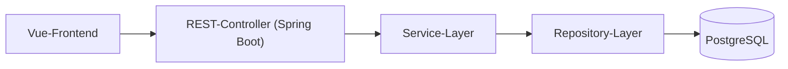

# Architekturentscheidungen, Taktiken & Entwurfsmuster für „MealPlanner“

Dieses Dokument beschreibt, wie die in `asr-utility-tree.md` erfassten architekturrelevanten Anforderungen (ASR)
durch Taktiken, Architekturentscheidungen und Entwurfsmuster adressiert werden.

---

## 3. Schritt 2 – Taktiken je Qualitätsattribut

### 3.1 Performance-Taktiken (P1, P2, P3)

Orientiert an **„Control Resource Demand“** und **„Manage Resources“**:

- **Begrenzen des Datenumfangs (Limit event response)**
  - Serverseitiges Paging für Rezepte (max. 50 pro Seite).
  - Nur benötigte Felder laden (projektionierte Queries, DTOs).
- **Reduktion von Overhead**
  - HTTP‑Keep‑Alive und Connection Pooling.
  - Datenbank‑Indizes auf häufig genutzten Spalten (z. B. Benutzer‑ID, Name, Tags).
- **Einführung von Parallelität (Introduce concurrency)**
  - Option, rechenintensive Operationen (z. B. zukünftige Statistiken) asynchron abzuwickeln.
- **Caching**
  - Caching seltener geänderter Referenzdaten (z. B. Standardzutaten, Tags).

### 3.2 Availability-Taktiken (A1)

Orientiert an **Availability Tactics** (Detect Faults, Recover from Faults, Prevent Faults):

- **Health Checks & Monitoring**
  - Spring Boot Actuator Health‑Endpoint; einfache Monitoring‑Lösung (z. B. Uptime‑Check).
- **Automatischer Neustart der Container**
  - Docker‑Restart‑Policy (z. B. `restart: always`) für Backend und Datenbank.
- **Graceful Shutdown / Deployments**
  - Sauberes Herunterfahren von Requests vor dem Stoppen des Containers.
- **Regelmäßige Backups**
  - Automatisierte Datenbank‑Backups zur Wiederherstellung nach schwereren Ausfällen.

### 3.3 Usability-Taktiken (U1)

Orientiert an **Usability Tactics** (Support User Initiative / Support System Initiative):

- **Klar geführte Flows**
  - Schrittweise UI für „Rezept anlegen“ und „Woche planen“ mit klaren Call‑to‑Actions.
- **Inline-Validierung & verständliche Fehlermeldungen**
  - Direkte Hinweise bei fehlenden oder ungültigen Eingaben.
- **Sinnvolle Defaults & Vorlagen**
  - Vorbelegung der aktuellen Woche; Vorschläge für Mahlzeiten.
- **Mobile-taugliches Layout**
  - Responsives Design, keine horizontale Scroll‑Orgie, Buttons gut bedienbar.

### 3.4 Modifiability-Taktiken (M1)

Orientiert an **Modifiability Tactics**:

- **Geschichtete Architektur (Increase cohesion / Reduce coupling)**
  - Strikte Trennung von API (Controller), Geschäftslogik (Service), Persistenz (Repository).
- **Fachlich geschnittene Module/Packages (Increase semantic coherence)**
  - Module: `user`, `recipe`, `mealplan`, `shoppinglist`, `shared`.
- **Abstraktion & Dependency Injection (Encapsulate, Use an intermediary)**
  - Repositories & Services als Interfaces; Implementierung via Spring‑Beans.
- **Konfiguration statt Hardcoding (Defer binding)**
  - Konfigurierbare Einstellungen (z. B. Standardanzahl Tage, Feature‑Toggles) über Properties/Environment.

### 3.5 Security-Taktiken (S1)

Orientiert an **Security Tactics** (Detect/Resist/React):

- **Authentifizierung**
  - Login/Registrierung mit Passwort‑Hashing (z. B. bcrypt).
- **Autorisierung & Einschränkung der Exposition**
  - Alle Queries und Endpoints filtern grundsätzlich nach `userId`; keine fremden IDs in URLs ohne Prüfung.
- **HTTPS & sichere Defaults**
  - Zugriff ausschließlich über HTTPS; sichere Standardkonfiguration (z. B. HSTS, sichere Cookies).
- **Audit-Logging**
  - Protokollierung sicherheitsrelevanter Aktionen (Login, Passwortänderungen).

---

## 4. Schritt 3 – Architekturentscheidungen & Entwurfsmuster

### 4.1 Architekturstil & Struktur

1. **Architekturstil: Layered Monolith mit Spring Boot**
   - **Entscheidung:** Backend als klassischer Schichten‑Monolith:
     - API‑Schicht (`controller`)
     - Geschäftslogik‑Schicht (`service`)
     - Persistenzschicht (`repository`)
   - **Begründung:** 
     - Einfach zu verstehen und zu entwickeln (Studentenprojekt).
     - Unterstützt Modifiability (M1) und Performance‑Optimierungen (P1‑P3).

2. **Fachliche Module**
   - **Entscheidung:** Unterteilung des Codes in Module/Packages:
     - `user` – Nutzeraccounts & Authentifizierung
     - `recipe` – Rezepte & Zutaten
     - `mealplan` – Wochenpläne
     - `shoppinglist` – Einkaufszettel
     - `shared` – gemeinsame Infrastruktur (z. B. Fehlerbehandlung, Security)
   - **Begründung:** 
     - Hohe Kohäsion pro Modul, geringe Kopplung → einfachere Änderungen (M1).

3. **Schnittstelle Frontend–Backend: REST + JSON**
   - **Entscheidung:** Vue‑Frontend spricht ausschließlich über JSON‑basierte REST‑APIs mit dem Spring‑Boot‑Backend.
   - **Begründung:** 
     - Klare Trennung von UI und Backend.
     - Gute Testbarkeit (API‑Tests) und spätere Erweiterbarkeit (z. B. Mobile App).

4. **Persistenz: PostgreSQL via Spring Data JPA**
   - **Entscheidung:** Nutzung von PostgreSQL mit Spring Data JPA für CRUD‑Operationen.
   - **Begründung:** 
     - Transaktionen für zusammenhängende Operationen (z. B. Wochenplan + Einkaufszettel).
     - Bekannter Stack, einfacher Start; DB‑Indizes für Performance.

5. **Deployment: Docker auf Linux-Rootserver**
   - **Entscheidung:** Backend, Frontend und Datenbank laufen jeweils in eigenen Docker‑Containern (Docker Compose).
   - **Begründung:** 
     - Einfache Reproduzierbarkeit der Umgebung, automatischer Neustart bei Fehlern.

#### 4.1.1 Übersicht als Diagramm

### 4.2 Eingesetzte Entwurfsmuster (Backend)

- **Controller–Service–Repository**
  - Controller: REST‑API (HTTP/JSON).
  - Services: Fachlogik (z. B. Erstellen eines Wochenplans, Generieren eines Einkaufszettels).
  - Repositories: Datenzugriff auf JPA‑Entities.
- **DTOs & Mapper**
  - DTO‑Objekte für Ein-/Ausgabe, getrennt von JPA‑Entities.
  - Mapper (manuell oder z. B. MapStruct) zwischen Entities und DTOs.
- **Factory/Builder für komplexe Domänenobjekte**
  - Z. B. Erstellung eines Wochenplans aus mehreren Rezepten und Metadaten über eine Factory/Service‑Methode.
- **Error-Handling-Pattern**
  - Zentrales Exception‑Handling (Spring `@ControllerAdvice`) mit standardisierten Fehlerantworten.

### 4.3 Muster & Entscheidungen für Usability

- Einseitige SPA (Vue) für schnelle Interaktionen.  
- Komponentenbasierte UI → wiederverwendbare Formularelemente.  
- Routing‑Konzept u. a. mit Pfaden:
  - `/recipes` – Rezepte verwalten
  - `/meal-plans` – Wochenpläne
  - `/shopping-lists` – Einkaufszettel

### 4.4 Mapping: ASR ↔ Taktiken ↔ Architektur

Beispiele für den Zusammenhang:

- **P1 (Rezepte-Liste ≤ 1 s)**
  - Taktiken: Limit event response (Paging), Reduce overhead (DB‑Indizes).
  - Architektur: REST‑Endpoint `GET /api/recipes` mit Paging, JPA‑Repository mit Indizes auf `user_id` und `title`.

- **P3 (Einkaufszettel generieren ≤ 2 s)**
  - Taktiken: Introduce concurrency (optional), Limit event response.
  - Architektur: Service‑Methode aggregiert Zutaten in der DB (statt alles im Java‑Code zu iterieren), optimierte Queries.

- **A1 (99 % Verfügbarkeit & Recovery ≤ 5 Min)**
  - Taktiken: Health checks, automatischer Container‑Restart, regelmäßige Backups.
  - Architektur: Docker‑Compose Setup mit Restart‑Policy, Actuator Health‑Endpoint, Backup‑Skripte für PostgreSQL.

- **M1 (Routineänderung ≤ 3 PT)**
  - Taktiken: Increase cohesion, Reduce coupling, Defer binding.
  - Architektur: Fachlich geschnittene Module, Controller–Service–Repository‑Pattern, Konfiguration für Feature‑Toggles.

- **S1 (Zugriff nur auf eigene Daten)**
  - Taktiken: Authenticate actors, Authorize actors, Limit exposure, Audit trail.
  - Architektur: Security‑Konfiguration (z. B. Spring Security), alle Repositories filtern nach `userId`, Logging von verdächtigen Aufrufen.

---

## 5. Fazit

- **Schritt 1:** ASR & Utility Tree sind in `asr-utility-tree.md` dokumentiert.  
- **Schritt 2:** Dieses Dokument beschreibt die gewählten Taktiken pro Qualitätsattribut.  
- **Schritt 3:** Architekturentscheidungen und konkrete Muster sind festgehalten und jeweils mit den Szenarien verknüpft.

Damit erfüllt das Projekt die Anforderungen an die ASR-Dokumentation aus der Übung.
