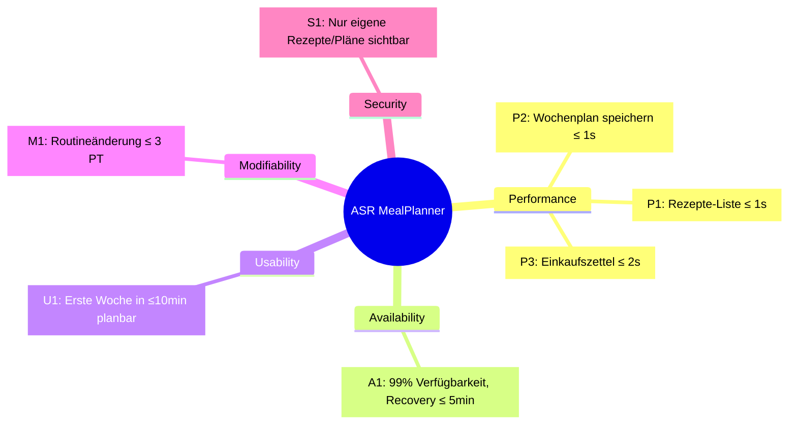

# Utility Tree & Qualitätsattribut-Szenarien für NomNomNow

## 1. Projektkontext

**Projekt:** NomNomNow – Essensplanungs-App  

Nutzer:innen können eigene Rezepte anlegen, eine komplette Woche planen und daraus automatisch einen Einkaufszettel generieren.

- **Stakeholder**
  - Endnutzer:innen (privat, ohne besondere Rollen)
- **Technischer Stack / Constraints**
  - Backend: Spring Boot (Java), Spring Data JPA
  - Datenbank: PostgreSQL (später ggf. andere relationale DB)
  - Frontend: Vue + TypeScript (SPA)
  - Deployment: Docker‑Container auf einem Linux‑Rootserver
- **Rahmenbedingungen**
  - Aktuell geringe Nutzerzahlen, die Anwendung soll aber grundsätzlich skalierbar sein.
  - Accounts mit Login/Registrierung → Datenschutz & Zugriff nur auf eigene Daten.
  - Änderungen vor allem an UI, Integrationen (z. B. spätere Rezept‑APIs) und Geschäftslogik erwartet.

---

## 2. Schritt 1 – Architecture Significant Requirements (ASR)

### 2.1 Qualitätsattribute & Priorisierung

1. **Performance** (höchste Priorität)  
   - „Sofortiges“ Laden von Rezepten und Bearbeiten von Wochenplänen.
2. **Availability**  
   - Zielverfügbarkeit ca. **99 %** (App soll meist erreichbar sein, kurze Ausfälle sind akzeptabel).
3. **Usability**  
   - Endnutzer sollen ohne Schulung Rezepte erstellen, Wochenpläne anlegen und Einkaufszettel generieren können.
4. **Modifiability** (aus erwarteten Änderungen abgeleitet)  
   - UI, Integrationen und Geschäftslogik müssen mit vertretbarem Aufwand änderbar sein.
5. **Security** (aus Account & Datenschutz abgeleitet)  
   - Nutzer:innen dürfen nur ihre eigenen Rezepte/Pläne/Einkaufszettel sehen und bearbeiten.

### 2.2 Utility Tree (Tabelle)

| ID  | Quality attribute | Refinement           | Quality attribute scenario (Kurzfassung)                                                                                                              | Business value | Technical risk |
|-----|-------------------|----------------------|-------------------------------------------------------------------------------------------------------------------------------------------------------|----------------|----------------|
| P1  | Performance       | Response time        | Nutzer lädt seine persönliche Rezepte‑Liste; Liste mit bis zu 50 Rezepten wird im Normalbetrieb in ≤ 1 s angezeigt.                                  | H              | M              |
| P2  | Performance       | Response time        | Nutzer speichert oder ändert einen Wochenplan; Speichern ist im Normalbetrieb in ≤ 1 s abgeschlossen.                                                | H              | M              |
| P3  | Performance       | Response time        | Nutzer generiert aus einem Wochenplan (max. 7 Tage) einen Einkaufszettel; der Einkaufszettel wird in ≤ 2 s generiert und angezeigt.                  | M              | M              |
| A1  | Availability      | Uptime & recovery    | Der MealPlanner ist im Jahresmittel zu **99 %** verfügbar; nach einem Crash des Backend‑Containers ist die App innerhalb von 5 Min wieder nutzbar.   | H              | M              |
| U1  | Usability         | Proficiency training | Neue Nutzer:innen können ohne Schulung innerhalb von 10 Min mindestens ein Rezept anlegen, einen Wochenplan erstellen und einen Einkaufszettel erzeugen. | M              | L              |
| M1  | Modifiability     | Routine change       | Eine typische fachliche Änderung (z. B. neues Rezept‑Attribut oder zusätzliche Filteroption) kann in ≤ 3 Personentagen implementiert, getestet, deployed werden. | M              | M              |
| S1  | Security          | Confidentiality      | Ein:e Nutzer:in kann ausschließlich eigene Rezepte, Wochenpläne und Einkaufszettel sehen/bearbeiten; Zugriffe auf fremde Daten werden immer blockiert. | H              | M              |

### 2.2.1 Utility Tree als Diagramm

---

## 2.3 Qualitätsattribut-Szenarien (6‑Part Form)

### P1 – Performance: Rezepte-Liste laden

- **Source (Stimulusquelle):** Angemeldete:r Nutzer:in  
- **Stimulus:** Navigiert zur Seite „Meine Rezepte“ oder aktualisiert den Filter.  
- **Artifact:** REST‑Endpoint `GET /api/recipes`, Service‑Schicht, Datenbank, Vue‑UI.  
- **Environment:** Normalbetrieb mit bis zu ca. 50 gleichzeitig aktiven Nutzer:innen.  
- **Response:** Backend liefert maximal 50 Rezepte; Frontend rendert die Liste vollständig und macht sie bedienbar.  
- **Response measure:** 95 % der Aufrufe antworten in ≤ 1 s; kein Aufruf dauert länger als 2 s.

### P2 – Performance: Wochenplan speichern

- **Source:** Angemeldete:r Nutzer:in  
- **Stimulus:** Legt einen neuen Wochenplan an oder ändert einen bestehenden Wochenplan und klickt auf „Speichern“.  
- **Artifact:** Endpoint `POST/PUT /api/meal-plans`, Service‑Logik, Datenbank.  
- **Environment:** Normalbetrieb, bis zu 50 gleichzeitige Nutzer:innen.  
- **Response:** Wochenplan wird persistiert und ist direkt erneut abrufbar; Frontend zeigt Erfolgsmeldung.  
- **Response measure:** 95 % der Speichervorgänge sind in ≤ 1 s abgeschlossen; kein Speichervorgang dauert länger als 2 s.

### P3 – Performance: Einkaufszettel generieren

- **Source:** Angemeldete:r Nutzer:in  
- **Stimulus:** Klickt auf „Einkaufszettel generieren“ für einen Wochenplan mit bis zu 7 Tagen und typischer Anzahl an Rezepten.  
- **Artifact:** Endpoint `POST /api/shopping-lists`, Aggregationslogik, Datenbank.  
- **Environment:** Normale bis erhöhte Last (z. B. Sonntagabend, mehrere Nutzer planen gleichzeitig).  
- **Response:** Einkaufszettel wird erzeugt, Zutatenmengen werden aggregiert und im Frontend angezeigt.  
- **Response measure:** 95 % der Generierungen dauern ≤ 2 s, keine länger als 4 s; Fehlerrate < 1 %.

### A1 – Availability: Zielverfügbarkeit & Recovery

- **Source:** Endnutzer:in  
- **Stimulus:** Versucht während der üblichen Nutzungszeiten (z. B. 06–23 Uhr) auf die App zuzugreifen.  
- **Artifact:** Gesamtes produktives System (Reverse Proxy, Backend‑Container, Datenbank).  
- **Environment:** Produktivbetrieb über ein Jahr, inklusive geplanter Deployments und ungeplanter Fehler.  
- **Response:** App ist erreichbar und funktionsfähig; bei Backend‑Crash wird der Container automatisch neu gestartet.  
- **Response measure:** Jährliche Verfügbarkeit mindestens 99 % (entspricht max. ca. 3,65 Tagen Ausfall/Jahr), Neustart nach Crash innerhalb von 5 Minuten.

### U1 – Usability: Erste Woche planen

- **Source:** Neue:r Nutzer:in ohne vorherige Schulung  
- **Stimulus:** Meldet sich an, legt ein erstes Rezept an, erstellt einen Wochenplan und generiert einen Einkaufszettel.  
- **Artifact:** Web‑UI (Vue), Validierung, Hilfetexte.  
- **Environment:** Standardbrowser (Desktop oder Smartphone), keine zusätzliche Dokumentation.  
- **Response:** Nutzer:in versteht Navigation und Formularstruktur und kann den End‑to‑End‑Prozess ohne externe Hilfe durchführen.  
- **Response measure:** 80 % neuer Nutzer:innen können innerhalb von 10 Minuten ein Rezept erstellen, eine Woche planen und einen Einkaufszettel generieren, mit höchstens zwei Validierungsfehlern.

### M1 – Modifiability: Routineänderung (neues Rezept-Attribut)

- **Source:** Product Owner / Fachseite  
- **Stimulus:** Neue Anforderung: z. B. „Kalorien pro Portion“ soll als weiteres Attribut in Rezepten gespeichert und filterbar gemacht werden.  
- **Artifact:** Domänenmodell „Rezept“, Datenbank‑Schema, REST‑API, UI‑Formulare & ‑Filter.  
- **Environment:** Entwicklungsumgebung mit bestehender Codebasis, automatisierten Tests und CI‑Pipeline.  
- **Response:** Änderung wird implementiert, Datenbank migriert, Tests angepasst/erweitert und neue Version wird ohne Regressionen in Produktion gebracht.  
- **Response measure:** Gesamtaufwand ≤ 3 Personentage; alle bestehenden automatisierten Tests bleiben grün; keine kritischen Bugs in den ersten 2 Wochen nach Deployment.

### S1 – Security: Zugriff nur auf eigene Daten

- **Source:** Authentifizierte:r Nutzer:in oder Angreifer  
- **Stimulus:** Versucht über die API oder UI auf eine Ressource (Rezept/Plan/Einkaufszettel) mit fremder Benutzer‑ID zuzugreifen.  
- **Artifact:** Authentifizierungs‑/Autorisierungslogik im Backend, Repositories.  
- **Environment:** Betrieb über das öffentliche Internet (HTTPS), normale Last.  
- **Response:** Anfrage wird mit HTTP‑Status 403/404 beantwortet; der Inhalt wird nicht preisgegeben; Vorfall wird in den Logs protokolliert.  
- **Response measure:** 100 % solcher Zugriffe werden blockiert; in keinem Fall werden Daten eines anderen Kontos ausgeliefert oder verändert.
