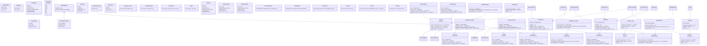

# Frontend UML Class Diagram

Based on the SRS and use cases; frontend stack: Vue.js + TypeScript.

```mermaid
classDiagram
direction TB

class CategoryModel {
  +id: string
  +name: string
  +description: string
}

class IngredientModel {
  +name: string
  +amount: string
  +unit: string
}

class StepModel {
  +order: number
  +text: string
}

class RecipeModel {
  +id: string
  +name: string
  +description: string
  +ingredients: IngredientModel[]
  +steps: StepModel[]
  +categoryIds: string[]
}

class DayOfWeek {
  <<enumeration>>
  MON
  TUE
  WED
  THU
  FRI
  SAT
  SUN
}

class DayAssignmentModel {
  +day: DayOfWeek
  +categoryId: string
  +recipeId: string
}

class WeekPlanModel {
  +weekStart: string
  +assignments: DayAssignmentModel[]
}

class UserModel {
  +id: string
  +email: string
  +displayName: string
  +roles: string[]
}

class HttpClient {
  <<interface>>
  +get(url: string, params?: any): Promise~any~
  +post(url: string, body: any): Promise~any~
  +put(url: string, body: any): Promise~any~
  +del(url: string): Promise~any~
}
class FetchHttpClientImpl {
  -baseUrl: string
}

class CategoryDto {
  +id: string
  +name: string
  +description: string
}
class CategoryCreateDto { +name: string, +description: string }
class CategoryUpdateDto { +name: string, +description: string }

class IngredientDto { +name: string, +amount: string, +unit: string }
class StepDto { +order: number, +text: string }

class RecipeDto {
  +id: string
  +name: string
  +description: string
  +ingredients: IngredientDto[]
  +steps: StepDto[]
  +categoryIds: string[]
}
class RecipeCreateDto {
  +name: string
  +ingredients: IngredientDto[]
  +steps: StepDto[]
  +categoryIds: string[]
}
class RecipeUpdateDto {
  +name: string
  +ingredients: IngredientDto[]
  +steps: StepDto[]
  +categoryIds: string[]
}

class DayAssignmentDto { +day: DayOfWeek, +categoryId: string, +recipeId: string }
class WeekPlanDto { +weekStart: string, +assignments: DayAssignmentDto[] }

class RegisterDto { +email: string, +password: string, +displayName: string }
class LoginDto { +email: string, +password: string }
class UserDto { +id: string, +email: string, +displayName: string, +roles: string[] }
class TokenDto { +accessToken: string, +expiresAt: string }

class CategoryApi {
  <<interface>>
  +list(): CategoryDto[]
  +get(id: string): CategoryDto
  +create(dto: CategoryCreateDto): CategoryDto
  +update(id: string, dto: CategoryUpdateDto): CategoryDto
}
class RecipeApi {
  <<interface>>
  +list(): RecipeDto[]
  +get(id: string): RecipeDto
  +create(dto: RecipeCreateDto): RecipeDto
  +update(id: string, dto: RecipeUpdateDto): RecipeDto
}
class WeekPlanApi {
  <<interface>>
  +getCurrent(): WeekPlanDto
  +setCategoryForDay(day: DayOfWeek, categoryId: string): WeekPlanDto
  +generateWeek(): WeekPlanDto
}
class AuthApi {
  <<interface>>
  +register(dto: RegisterDto): UserDto
  +login(credentials: LoginDto): TokenDto
  +logout(): void
}
class CategoryApiImpl {
  +list(): CategoryDto[]
  +get(id: string): CategoryDto
  +create(dto: CategoryCreateDto): CategoryDto
  +update(id: string, dto: CategoryUpdateDto): CategoryDto
}
class RecipeApiImpl {
  +list(): RecipeDto[]
  +get(id: string): RecipeDto
  +create(dto: RecipeCreateDto): RecipeDto
  +update(id: string, dto: RecipeUpdateDto): RecipeDto
}
class WeekPlanApiImpl {
  +getCurrent(): WeekPlanDto
  +setCategoryForDay(day: DayOfWeek, categoryId: string): WeekPlanDto
  +generateWeek(): WeekPlanDto
}
class AuthApiImpl {
  +register(dto: RegisterDto): UserDto
  +login(credentials: LoginDto): TokenDto
  +logout(): void
}

class CategoryService {
  <<interface>>
  +loadAll(): CategoryModel[]
  +getById(id: string): CategoryModel
  +create(dto: CategoryCreateDto): CategoryModel
  +update(id: string, dto: CategoryUpdateDto): CategoryModel
}
class RecipeService {
  <<interface>>
  +loadAll(): RecipeModel[]
  +getById(id: string): RecipeModel
  +create(dto: RecipeCreateDto): RecipeModel
  +update(id: string, dto: RecipeUpdateDto): RecipeModel
}
class WeekPlanService {
  <<interface>>
  +loadCurrentWeek(): WeekPlanModel
  +setCategoryForDay(day: DayOfWeek, categoryId: string): WeekPlanModel
  +generateWeek(): WeekPlanModel
}
class AuthService {
  <<interface>>
  +register(dto: RegisterDto): UserModel
  +login(creds: LoginDto): TokenDto
  +logout(): void
}
class CategoryServiceImpl {
  +loadAll(): CategoryModel[]
  +getById(id: string): CategoryModel
  +create(dto: CategoryCreateDto): CategoryModel
  +update(id: string, dto: CategoryUpdateDto): CategoryModel
}
class RecipeServiceImpl {
  +loadAll(): RecipeModel[]
  +getById(id: string): RecipeModel
  +create(dto: RecipeCreateDto): RecipeModel
  +update(id: string, dto: RecipeUpdateDto): RecipeModel
}
class WeekPlanServiceImpl {
  +loadCurrentWeek(): WeekPlanModel
  +setCategoryForDay(day: DayOfWeek, categoryId: string): WeekPlanModel
  +generateWeek(): WeekPlanModel
}
class AuthServiceImpl {
  +register(dto: RegisterDto): UserModel
  +login(creds: LoginDto): TokenDto
  +logout(): void
}

class CategoryValidator {}
class RecipeValidator {}
class CategoryMapper {}
class RecipeMapper {}

class CategoryStore {
  +categories: CategoryModel[]
  +loadAll(): void
  +getById(id: string): CategoryModel
  +create(dto: CategoryCreateDto): void
  +update(id: string, dto: CategoryUpdateDto): void
}

class RecipeStore {
  +recipes: RecipeModel[]
  +loadAll(): void
  +getById(id: string): RecipeModel
  +create(dto: RecipeCreateDto): void
  +update(id: string, dto: RecipeUpdateDto): void
}

class WeekPlanStore {
  +week: WeekPlanModel
  +loadCurrentWeek(): void
  +setCategoryForDay(day: DayOfWeek, categoryId: string): void
  +generateWeek(): void
}

class AuthStore {
  +user: UserModel
  +register(dto: RegisterDto): void
  +login(creds: LoginDto): void
  +logout(): void
}

class CategoryListView
class CategoryDetailView
class CategoryForm
class RecipeListView
class RecipeDetailView
class RecipeForm
class WeekOverviewView
class WeekPlanBoard
class Navbar

RecipeModel "*" -- "*" CategoryModel
WeekPlanModel *-- DayAssignmentModel

FetchHttpClientImpl --> HttpClient
CategoryApiImpl --> HttpClient
RecipeApiImpl --> HttpClient
WeekPlanApiImpl --> HttpClient
AuthApiImpl --> HttpClient

CategoryServiceImpl --> CategoryService
RecipeServiceImpl --> RecipeService
WeekPlanServiceImpl --> WeekPlanService
AuthServiceImpl --> AuthService

CategoryServiceImpl --> CategoryApi
RecipeServiceImpl --> RecipeApi
WeekPlanServiceImpl --> WeekPlanApi
AuthServiceImpl --> AuthApi

CategoryServiceImpl --> CategoryValidator
CategoryServiceImpl --> CategoryMapper
RecipeServiceImpl --> RecipeValidator
RecipeServiceImpl --> RecipeMapper

CategoryStore --> CategoryService
RecipeStore --> RecipeService
WeekPlanStore --> WeekPlanService
AuthStore --> AuthService

CategoryListView --> CategoryStore
CategoryDetailView --> CategoryStore
CategoryDetailView --> RecipeStore
CategoryForm --> CategoryStore

RecipeListView --> RecipeStore
RecipeDetailView --> RecipeStore
RecipeForm --> RecipeStore

WeekOverviewView --> WeekPlanStore
WeekOverviewView --> CategoryStore
WeekPlanBoard --> WeekPlanStore
Navbar --> AuthStore
```
