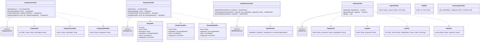

# Backend API Layer (UML Class Diagram)

```mermaid
classDiagram
direction TB

class CategoryController {
  +getCategories(): List~CategoryDto~
  +getCategoryById(id: UUID): CategoryDto
  +createCategory(dto: CategoryCreateDto): CategoryDto
  +updateCategory(id: UUID, dto: CategoryUpdateDto): CategoryDto
}
class RecipeController {
  +getRecipes(): List~RecipeDto~
  +getRecipeById(id: UUID): RecipeDto
  +createRecipe(dto: RecipeCreateDto): RecipeDto
  +updateRecipe(id: UUID, dto: RecipeUpdateDto): RecipeDto
}
class WeekPlanController {
  +getWeekPlan(weekStart: LocalDate): WeekPlanDto
  +setCategoryForDay(weekStart: LocalDate, day: DayOfWeek, categoryId: UUID): WeekPlanDto
  +generateWeek(weekStart: LocalDate): WeekPlanDto
}
class AuthController {
  +register(dto: RegisterDto): UserDto
  +login(credentials: LoginDto): TokenDto
  +logout(): void
}

class CategoryService { <<interface>> }
class RecipeService { <<interface>> }
class WeekPlanService { <<interface>> }
class AuthService { <<interface>> }

class CategoryDto { +id: UUID, +name: String, +description: String }
class CategoryCreateDto { +name: String, +description: String }
class CategoryUpdateDto { +name: String, +description: String }

class IngredientDto { +name: String, +amount: String, +unit: String }
class StepDto { +order: int, +text: String }

class RecipeDto {
  +id: UUID
  +name: String
  +description: String
  +ingredients: List~IngredientDto~
  +steps: List~StepDto~
  +categoryIds: List~UUID~
}
class RecipeCreateDto {
  +name: String
  +ingredients: List~IngredientDto~
  +steps: List~StepDto~
  +categoryIds: List~UUID~
}
class RecipeUpdateDto {
  +name: String
  +ingredients: List~IngredientDto~
  +steps: List~StepDto~
  +categoryIds: List~UUID~
}

class DayAssignmentDto { +day: DayOfWeek, +categoryId: UUID, +recipeId: UUID }
class WeekPlanDto { +weekStart: LocalDate, +assignments: List~DayAssignmentDto~ }

class RegisterDto { +email: String, +password: String, +displayName: String }
class LoginDto { +email: String, +password: String }
class UserDto { +id: UUID, +email: String, +displayName: String, +roles: List~String~ }
class TokenDto { +accessToken: String, +expiresAt: Instant }

CategoryController --> CategoryService
RecipeController --> RecipeService
WeekPlanController --> WeekPlanService
AuthController --> AuthService

CategoryController ..> CategoryDto
CategoryController ..> CategoryCreateDto
CategoryController ..> CategoryUpdateDto
RecipeController ..> RecipeDto
RecipeController ..> RecipeCreateDto
RecipeController ..> RecipeUpdateDto
WeekPlanController ..> WeekPlanDto
AuthController ..> RegisterDto
AuthController ..> LoginDto
AuthController ..> UserDto
AuthController ..> TokenDto
```
