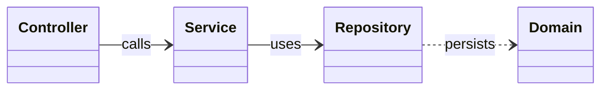

# Backend UML Class Diagrams (Index)

Zur besseren Lesbarkeit ist das Backend in mehrere, fokussierte Klassendiagramme aufgeteilt:

- Domainmodell: [Backend_Domain_Class_Diagram.md](Backend_Domain_Class_Diagram.md)
- Services/Business-Logik: [Backend_Service_Class_Diagram.md](Backend_Service_Class_Diagram.md)
- API/Controller + DTOs: [Backend_API_Class_Diagram.md](Backend_API_Class_Diagram.md)
- Persistence/Repositories: [Backend_Persistence_Class_Diagram.md](Backend_Persistence_Class_Diagram.md)

Überblick (Layering):

Hinweis: Der ursprüngliche, kombinierte Entwurf ist weiterhin in `Backend_Class_Diagram.md` enthalten, kann jedoch aufgrund der Größe unübersichtlich sein. Bitte die obigen, thematisch getrennten Diagramme verwenden.

