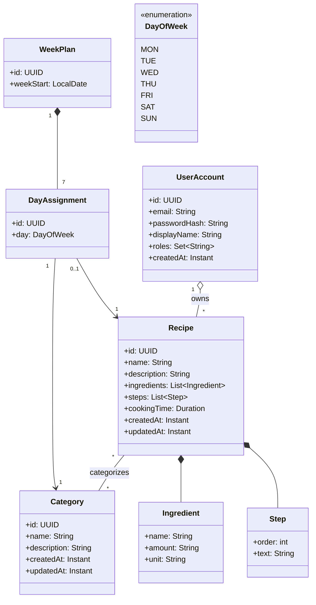

# Backend Domain Model (UML Class Diagram)

```mermaid
classDiagram
direction TB

class Category {
  +id: UUID
  +name: String
  +description: String
  +createdAt: Instant
  +updatedAt: Instant
}

class Ingredient {
  +name: String
  +amount: String
  +unit: String
}

class Step {
  +order: int
  +text: String
}

class Recipe {
  +id: UUID
  +name: String
  +description: String
  +ingredients: List~Ingredient~
  +steps: List~Step~
  +cookingTime: Duration
  +createdAt: Instant
  +updatedAt: Instant
}

class WeekPlan {
  +id: UUID
  +weekStart: LocalDate
}

class DayAssignment {
  +id: UUID
  +day: DayOfWeek
}

class UserAccount {
  +id: UUID
  +email: String
  +passwordHash: String
  +displayName: String
  +roles: Set~String~
  +createdAt: Instant
}

class DayOfWeek {
  <<enumeration>>
  MON
  TUE
  WED
  THU
  FRI
  SAT
  SUN
}

Recipe "*" -- "*" Category : categorizes
Recipe *-- Ingredient
Recipe *-- Step
WeekPlan "1" *-- "7" DayAssignment
DayAssignment "1" --> "1" Category
DayAssignment "0..1" --> "1" Recipe
UserAccount "1" o-- "*" Recipe : owns
```

