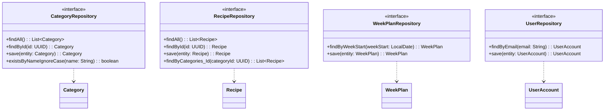

# Backend Persistence (UML Class Diagram)

```mermaid

classDiagram
direction TB

class CategoryRepository {
  <<interface>>
  +findAll(): List~Category~
  +findById(id: UUID): Category
  +save(entity: Category): Category
  +existsByNameIgnoreCase(name: String): boolean
}
class RecipeRepository {
  <<interface>>
  +findAll(): List~Recipe~
  +findById(id: UUID): Recipe
  +save(entity: Recipe): Recipe
  +findByCategories_Id(categoryId: UUID): List~Recipe~
}
class WeekPlanRepository {
  <<interface>>
  +findByWeekStart(weekStart: LocalDate): WeekPlan
  +save(entity: WeekPlan): WeekPlan
}
class UserRepository {
  <<interface>>
  +findByEmail(email: String): UserAccount
  +save(entity: UserAccount): UserAccount
}

class Category
class Recipe
class WeekPlan
class UserAccount

CategoryRepository ..> Category
RecipeRepository ..> Recipe
WeekPlanRepository ..> WeekPlan
UserRepository ..> UserAccount
```

