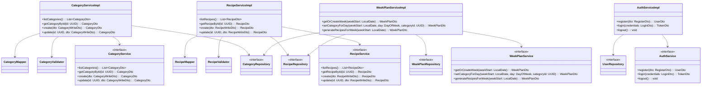

# Backend Services (UML Class Diagram)

```mermaid
classDiagram
direction TB

class CategoryService {
  <<interface>>
  +listCategories(): List~CategoryDto~
  +getCategoryById(id: UUID): CategoryDto
  +create(dto: CategoryWriteDto): CategoryDto
  +update(id: UUID, dto: CategoryWriteDto): CategoryDto
}

class RecipeService {
  <<interface>>
  +listRecipes(): List~RecipeDto~
  +getRecipeById(id: UUID): RecipeDto
  +create(dto: RecipeWriteDto): RecipeDto
  +update(id: UUID, dto: RecipeWriteDto): RecipeDto
}

class WeekPlanService {
  <<interface>>
  +getOrCreateWeek(weekStart: LocalDate): WeekPlanDto
  +setCategoryForDay(weekStart: LocalDate, day: DayOfWeek, categoryId: UUID): WeekPlanDto
  +generateRecipesForWeek(weekStart: LocalDate): WeekPlanDto
}

class AuthService {
  <<interface>>
  +register(dto: RegisterDto): UserDto
  +login(credentials: LoginDto): TokenDto
  +logout(): void
}

class CategoryServiceImpl {
  +listCategories(): List~CategoryDto~
  +getCategoryById(id: UUID): CategoryDto
  +create(dto: CategoryWriteDto): CategoryDto
  +update(id: UUID, dto: CategoryWriteDto): CategoryDto
}
class RecipeServiceImpl {
  +listRecipes(): List~RecipeDto~
  +getRecipeById(id: UUID): RecipeDto
  +create(dto: RecipeWriteDto): RecipeDto
  +update(id: UUID, dto: RecipeWriteDto): RecipeDto
}
class WeekPlanServiceImpl {
  +getOrCreateWeek(weekStart: LocalDate): WeekPlanDto
  +setCategoryForDay(weekStart: LocalDate, day: DayOfWeek, categoryId: UUID): WeekPlanDto
  +generateRecipesForWeek(weekStart: LocalDate): WeekPlanDto
}
class AuthServiceImpl {
  +register(dto: RegisterDto): UserDto
  +login(credentials: LoginDto): TokenDto
  +logout(): void
}

class CategoryRepository {
  <<interface>>
}
class RecipeRepository {
  <<interface>>
}
class WeekPlanRepository {
  <<interface>>
}
class UserRepository {
  <<interface>>
}

class CategoryValidator
class RecipeValidator
class CategoryMapper
class RecipeMapper

CategoryServiceImpl --> CategoryService
RecipeServiceImpl --> RecipeService
WeekPlanServiceImpl --> WeekPlanService
AuthServiceImpl --> AuthService

CategoryServiceImpl --> CategoryRepository
RecipeServiceImpl --> RecipeRepository
WeekPlanServiceImpl --> WeekPlanRepository
WeekPlanServiceImpl --> CategoryRepository
WeekPlanServiceImpl --> RecipeRepository
AuthServiceImpl --> UserRepository

CategoryServiceImpl --> CategoryValidator
CategoryServiceImpl --> CategoryMapper
RecipeServiceImpl --> RecipeValidator
RecipeServiceImpl --> RecipeMapper
```
