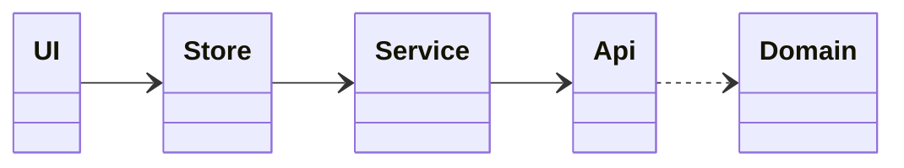

# Frontend UML Class Diagrams (Index)

Zur besseren Übersicht sind die Frontend-Klassendiagramme nach Verantwortlichkeiten getrennt:

- Domain & DTOs: [Frontend_Domain_Class_Diagram.md](Frontend_Domain_Class_Diagram.md)
- Infrastruktur (HTTP/APIs): [Frontend_Infrastructure_Class_Diagram.md](Frontend_Infrastructure_Class_Diagram.md)
- Services & Mapping: [Frontend_Service_Class_Diagram.md](Frontend_Service_Class_Diagram.md)
- State & UI: [Frontend_State_UI_Class_Diagram.md](Frontend_State_UI_Class_Diagram.md)

Schichtenüberblick:

