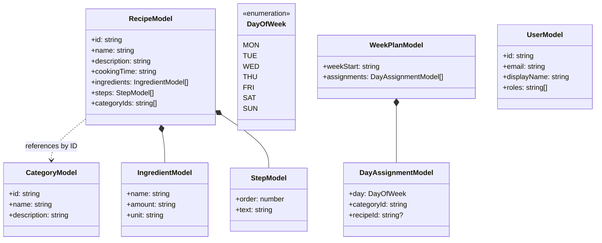

# Frontend Domain Model (UML Class Diagram)

```mermaid
classDiagram
direction TB

class CategoryModel {
+id: string
+name: string
+description: string
}

class IngredientModel {
+name: string
+amount: string
+unit: string
}

class StepModel {
+order: number
+text: string
}

class RecipeModel {
+id: string
+name: string
+description: string
+cookingTime: string
+ingredients: IngredientModel[]
+steps: StepModel[]
+categoryIds: string[]
}

class DayOfWeek {
<<enumeration>>
MON
TUE
WED
THU
FRI
SAT
SUN
}

class DayAssignmentModel {
+day: DayOfWeek
+categoryId: string
+recipeId: string?
}

class WeekPlanModel {
+weekStart: string
+assignments: DayAssignmentModel[]
}

class UserModel {
+id: string
+email: string
+displayName: string
+roles: string[]
}

RecipeModel ..> CategoryModel : references by ID
RecipeModel *-- IngredientModel
RecipeModel *-- StepModel
WeekPlanModel *-- DayAssignmentModel
```

