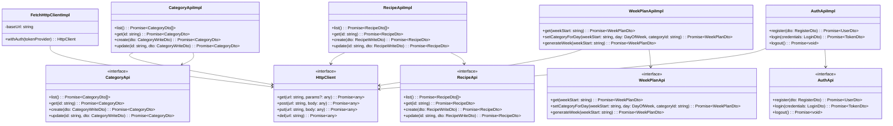

# Frontend Infrastructure (UML Class Diagram)

```mermaid
classDiagram
direction TB

class HttpClient {
  <<interface>>
  +get(url: string, params?: any): Promise~any~
  +post(url: string, body: any): Promise~any~
  +put(url: string, body: any): Promise~any~
  +del(url: string): Promise~any~
}

class FetchHttpClientImpl {
  -baseUrl: string
  +withAuth(tokenProvider): HttpClient
}

class CategoryApi {
  <<interface>>
  +list(): Promise~CategoryDto[]~
  +get(id: string): Promise~CategoryDto~
  +create(dto: CategoryWriteDto): Promise~CategoryDto~
  +update(id: string, dto: CategoryWriteDto): Promise~CategoryDto~
}

class CategoryApiImpl {
  +list(): Promise~CategoryDto[]~
  +get(id: string): Promise~CategoryDto~
  +create(dto: CategoryWriteDto): Promise~CategoryDto~
  +update(id: string, dto: CategoryWriteDto): Promise~CategoryDto~
}

class RecipeApi {
  <<interface>>
  +list(): Promise~RecipeDto[]~
  +get(id: string): Promise~RecipeDto~
  +create(dto: RecipeWriteDto): Promise~RecipeDto~
  +update(id: string, dto: RecipeWriteDto): Promise~RecipeDto~
}

class RecipeApiImpl {
  +list(): Promise~RecipeDto[]~
  +get(id: string): Promise~RecipeDto~
  +create(dto: RecipeWriteDto): Promise~RecipeDto~
  +update(id: string, dto: RecipeWriteDto): Promise~RecipeDto~
}

class WeekPlanApi {
  <<interface>>
  +get(weekStart: string): Promise~WeekPlanDto~
  +setCategoryForDay(weekStart: string, day: DayOfWeek, categoryId: string): Promise~WeekPlanDto~
  +generateWeek(weekStart: string): Promise~WeekPlanDto~
}

class WeekPlanApiImpl {
  +get(weekStart: string): Promise~WeekPlanDto~
  +setCategoryForDay(weekStart: string, day: DayOfWeek, categoryId: string): Promise~WeekPlanDto~
  +generateWeek(weekStart: string): Promise~WeekPlanDto~
}

class AuthApi {
  <<interface>>
  +register(dto: RegisterDto): Promise~UserDto~
  +login(credentials: LoginDto): Promise~TokenDto~
  +logout(): Promise~void~
}

class AuthApiImpl {
  +register(dto: RegisterDto): Promise~UserDto~
  +login(credentials: LoginDto): Promise~TokenDto~
  +logout(): Promise~void~
}

FetchHttpClientImpl --> HttpClient

CategoryApiImpl --> HttpClient
RecipeApiImpl --> HttpClient
WeekPlanApiImpl --> HttpClient
AuthApiImpl --> HttpClient

CategoryApiImpl --> CategoryApi
RecipeApiImpl --> RecipeApi
WeekPlanApiImpl --> WeekPlanApi
AuthApiImpl --> AuthApi
```

