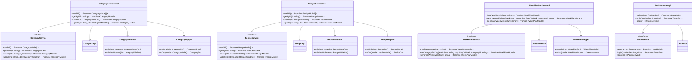

# Frontend Services & Mapping (UML Class Diagram)

```mermaid
classDiagram
direction TB

class CategoryService {
  <<interface>>
  +loadAll(): Promise~CategoryModel[]~
  +getById(id: string): Promise~CategoryModel~
  +create(dto: CategoryWriteDto): Promise~CategoryModel~
  +update(id: string, dto: CategoryWriteDto): Promise~CategoryModel~
}

class CategoryServiceImpl {
  +loadAll(): Promise~CategoryModel[]~
  +getById(id: string): Promise~CategoryModel~
  +create(dto: CategoryWriteDto): Promise~CategoryModel~
  +update(id: string, dto: CategoryWriteDto): Promise~CategoryModel~
}

class RecipeService {
  <<interface>>
  +loadAll(): Promise~RecipeModel[]~
  +getById(id: string): Promise~RecipeModel~
  +create(dto: RecipeWriteDto): Promise~RecipeModel~
  +update(id: string, dto: RecipeWriteDto): Promise~RecipeModel~
}

class RecipeServiceImpl {
  +loadAll(): Promise~RecipeModel[]~
  +getById(id: string): Promise~RecipeModel~
  +create(dto: RecipeWriteDto): Promise~RecipeModel~
  +update(id: string, dto: RecipeWriteDto): Promise~RecipeModel~
}

class WeekPlanService {
  <<interface>>
  +loadWeek(weekStart: string): Promise~WeekPlanModel~
  +setCategoryForDay(weekStart: string, day: DayOfWeek, categoryId: string): Promise~WeekPlanModel~
  +generateWeek(weekStart: string): Promise~WeekPlanModel~
}

class WeekPlanServiceImpl {
  +loadWeek(weekStart: string): Promise~WeekPlanModel~
  +setCategoryForDay(weekStart: string, day: DayOfWeek, categoryId: string): Promise~WeekPlanModel~
  +generateWeek(weekStart: string): Promise~WeekPlanModel~
}

class AuthService {
  <<interface>>
  +register(dto: RegisterDto): Promise~UserModel~
  +login(credentials: LoginDto): Promise~TokenDto~
  +logout(): Promise~void~
}

class AuthServiceImpl {
  +register(dto: RegisterDto): Promise~UserModel~
  +login(credentials: LoginDto): Promise~TokenDto~
  +logout(): Promise~void~
}

class CategoryValidator {
  +validateCreate(dto: CategoryWriteDto)
  +validateUpdate(dto: CategoryWriteDto)
}

class RecipeValidator {
  +validateCreate(dto: RecipeWriteDto)
  +validateUpdate(dto: RecipeWriteDto)
}

class CategoryMapper {
  +toModel(dto: CategoryDto): CategoryModel
  +toDto(model: CategoryModel): CategoryDto
}

class RecipeMapper {
  +toModel(dto: RecipeDto): RecipeModel
  +toDto(model: RecipeModel): RecipeDto
}

class WeekPlanMapper {
  +toModel(dto: WeekPlanDto): WeekPlanModel
  +toDto(model: WeekPlanModel): WeekPlanDto
}

CategoryServiceImpl --> CategoryService
RecipeServiceImpl --> RecipeService
WeekPlanServiceImpl --> WeekPlanService
AuthServiceImpl --> AuthService

CategoryServiceImpl --> CategoryApi
RecipeServiceImpl --> RecipeApi
WeekPlanServiceImpl --> WeekPlanApi
AuthServiceImpl --> AuthApi

CategoryServiceImpl --> CategoryValidator
CategoryServiceImpl --> CategoryMapper
RecipeServiceImpl --> RecipeValidator
RecipeServiceImpl --> RecipeMapper
WeekPlanServiceImpl --> WeekPlanMapper
```
