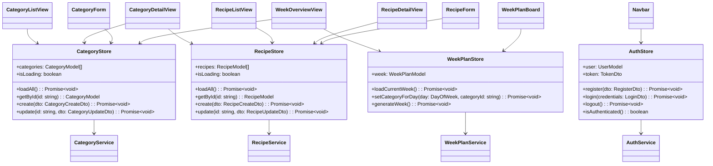

# Frontend State & UI (UML Class Diagram)

```mermaid
classDiagram
direction TB

class CategoryStore {
  +categories: CategoryModel[]
  +isLoading: boolean
  +loadAll(): Promise~void~
  +getById(id: string): CategoryModel
  +create(dto: CategoryCreateDto): Promise~void~
  +update(id: string, dto: CategoryUpdateDto): Promise~void~
}

class RecipeStore {
  +recipes: RecipeModel[]
  +isLoading: boolean
  +loadAll(): Promise~void~
  +getById(id: string): RecipeModel
  +create(dto: RecipeCreateDto): Promise~void~
  +update(id: string, dto: RecipeUpdateDto): Promise~void~
}

class WeekPlanStore {
  +week: WeekPlanModel
  +loadCurrentWeek(): Promise~void~
  +setCategoryForDay(day: DayOfWeek, categoryId: string): Promise~void~
  +generateWeek(): Promise~void~
}

class AuthStore {
  +user: UserModel
  +token: TokenDto
  +register(dto: RegisterDto): Promise~void~
  +login(credentials: LoginDto): Promise~void~
  +logout(): Promise~void~
  +isAuthenticated(): boolean
}

class CategoryListView
class CategoryDetailView
class CategoryForm
class RecipeListView
class RecipeDetailView
class RecipeForm
class WeekOverviewView
class WeekPlanBoard
class Navbar

CategoryStore --> CategoryService
RecipeStore --> RecipeService
WeekPlanStore --> WeekPlanService
AuthStore --> AuthService

CategoryListView --> CategoryStore
CategoryDetailView --> CategoryStore
CategoryDetailView --> RecipeStore
CategoryForm --> CategoryStore

RecipeListView --> RecipeStore
RecipeDetailView --> RecipeStore
RecipeForm --> RecipeStore

WeekOverviewView --> WeekPlanStore
WeekOverviewView --> CategoryStore
WeekPlanBoard --> WeekPlanStore
Navbar --> AuthStore
```

