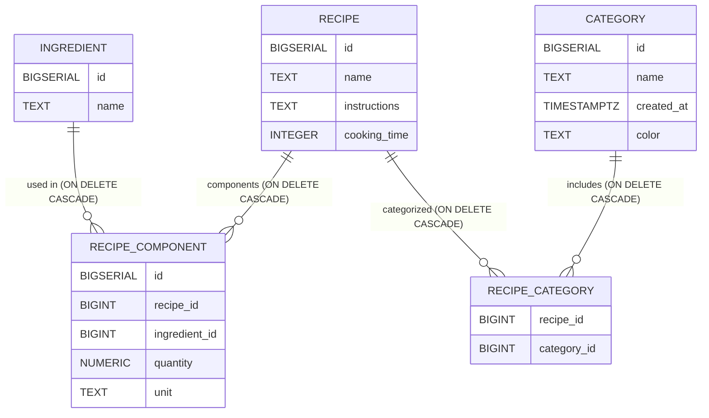

```mermaid
    erDiagram
    INGREDIENT {
        BIGSERIAL id
        TEXT name
    }

    RECIPE {
        BIGSERIAL id
        TEXT name
        TEXT instructions
        INTEGER cooking_time
    }

    CATEGORY {
        BIGSERIAL id
        TEXT name
        TIMESTAMPTZ created_at
        TEXT color
    }

    RECIPE_COMPONENT {
        BIGSERIAL id
        BIGINT recipe_id
        BIGINT ingredient_id
        NUMERIC quantity
        TEXT unit
    }

    RECIPE_CATEGORY {
        BIGINT recipe_id
        BIGINT category_id
    }

    RECIPE ||--o{ RECIPE_COMPONENT : "components (ON DELETE CASCADE)"
    INGREDIENT ||--o{ RECIPE_COMPONENT : "used in (ON DELETE CASCADE)"
    RECIPE ||--o{ RECIPE_CATEGORY : "categorized (ON DELETE CASCADE)"
    CATEGORY ||--o{ RECIPE_CATEGORY : "includes (ON DELETE CASCADE)"

```