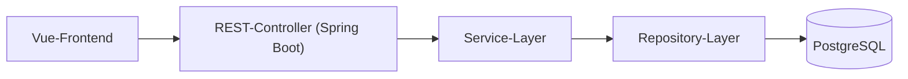

# Software Architecture Document

Version <1.0>

---

## Revision History

| Date       | Version | Description                     | Author                        |
|------------|---------|---------------------------------|-------------------------------|
| 30.11.2025 | 1.0     | First creation of the document  | Dylan O'Reilly, Robin Fischer |
| 22.12.2025 | 1.1     | Added Deployment View           |  Robin Fischer |

---

## 1. Introduction

### 1.1 Purpose

Zweck dieses Dokuments ist es, die zentralen Architekturentscheidungen, Sichten und Qualitätsanforderungen von NomNomNow nachvollziehbar festzuhalten

### 1.2 Scope

Das Dokument umfasst die Server‑ und Web‑Anwendung von NomNomNow inklusive Backend‑Services, Datenbank, Web‑Frontend und Docker‑basiertem Deployment. Themen wie organisatorische Prozesse oder detaillierte UI‑Designs sind nur insoweit enthalten, wie sie architekturrelevant sind.

### 1.3 Definitions, Acronyms and Abbreviations

| Abbrevation | Explanation                         |
|-------------|-------------------------------------|
| SAD         | Software Architecture Documentation |
| UC          | Use-Case                            |
| UCRS        | Use-Case Realization Specification  |
| n/a         | not applicable                      |
| tbd         | to be determined                    |
| UCD         | overall Use Case Diagram            |
| FAQ         | Frequently asked Questions          |

### 1.4 References

| Title            |    Date    | Publishing organization |
|------------------|:----------:|-------------------------|
| [ASR-Overview](https://github.com/Nom-Nom-Now/docs/blob/cff4eaa5b92cddc9d61bc1e1b36f9a0887d240fd/ASR/asr-overview.md) | 30.11.25 | NomNomNow                 |
| [GitHub](https://github.com/Nom-Nom-Now)                                        | 30.11.25 |  NomNomNow                  |

### 1.5 Overview

- [1 Introduction](#1-introduction)
    - [1.1 Purpose](#11-purpose)
    - [1.2 Scope](#12-scope)
    - [1.3 Definitions, Acronyms, and Abbreviations](#13-definitions-acronyms-and-abbreviations)
    - [1.4 References](#14-references)
    - [1.5 Overview](#15-overview)
- [2 Architectural Representation](#2-architectural-representation)
- [3 Architectural Goals and Constraints](#3-architectural-goals-and-constraints)
    - [3.1 Architecturally Significant Requirements](#31-Architecturally-Significant-Requirements)
    - [3.2 Key Tactics and Constraints](#32-Key-Tactics-and-Constraints)
- [4 Use-Case View](#4-use-case-view)
- [5 Logical View](#5-logical-view)
    - [5.1 Overview](#51-overview)
    - [5.2 Architecturally Significant Design Packages](#52-architecturally-significant-design-packages)
- [6 Process View](#6-process-view)
- [7 Deployment View](#7-deployment-view)
- [8 Implementation View](#8-implementation-view)
    - [8.1 Overview](#81-overview)
    - [8.2 Layers](#82-layers)
- [9 Data View](#9-data-view-optional)
- [10 Size and Performance](#10-size-and-performance)
- [11 Quality](#11-quality)

---

## 2. Architectural Representation

Die Architektur von NomNomNow wird nach dem 4+1‑Modell beschrieben und umfasst die Logical View, Process View, Development/Implementation View und Physical/Deployment View, ergänzt durch eine Use‑Case View als zentrales Bindeglied. Die Use‑Case View hält die wichtigsten Szenarien (z. B. Rezepte verwalten, Woche planen, Einkaufszettel generieren) fest, die anschließend in den vier technischen Sichten durch Schichten, Module, Prozesse und Deployments konkretisiert werden.

---

## 3. Architectural Goals and Constraints

Die Architektur von NomNomNow wird vor allem durch die Qualitätsattribute Performance, Availability, Usability sowie ergänzend Modifiability und Security bestimmt. Das System wird als geschichteter Spring‑Boot‑Monolith mit Vue‑SPA, PostgreSQL und Docker‑Deployment auf einem Linux‑Rootserver umgesetzt, um Betrieb und Änderungen bei kleiner Teamgröße beherrschbar zu halten.

### 3.1 Architecturally Significant Requirements

Architekturrelevant sind insbesondere:

Performance: Antworten für Listen- und Generierungsoperationen meist in ≤ Sekunden (P1-P3).

Availability: Zielverfügbarkeit ca. 99%, Recovery nach Container‑Crash innerhalb weniger Minuten (A1).

Usability: Neue Nutzer:innen können ohne Schulung in ca. 10 Minuten Rezept, Wochenplan und Einkaufszettel erzeugen (U1).

Modifiability & Security: Routineänderungen in ≤ PT (M1) und konsequente Zugriffsbeschränkung auf eigene Daten (S1).

### 3.2 Key Tactics and Constraints

Zur Erfüllung der ASR werden u.a. Paging und Indizes für Performance, Health‑Checks und Docker‑Restart‑Policies für Availability sowie eine klare Layer‑Architektur (Controller-Service-Repository) und fachliche Module für Modifiability eingesetzt. Security wird durch Authentifizierung, Autorisierung nach userId, HTTPS‑Zwang und Audit‑Logging adressiert; technologische Vorgaben (Spring Boot, Vue, PostgreSQL, Docker) und das studentische Projektsetting begrenzen dabei die Komplexität der Architektur.

---

## 4. Use-Case View

Tbd

---

## 5. Logical View

### 5.1 Overview

[Klassendiagramme-Backend](https://github.com/Nom-Nom-Now/docs/tree/09c777528407415838955d39106580fa96db6f9c/Class-diagrams/backend-diagrams)

[Klassendiagramme-Frontend](https://github.com/Nom-Nom-Now/docs/tree/09c777528407415838955d39106580fa96db6f9c/Class-diagrams/frontend-diagrams)
### 5.2 Architecturally Significant Design Packages

Die Architektur von NomNomNow folgt einem 3‑Schichten‑Modell in Form eines Layered Monoliths: API‑Schicht (Controller), Geschäftslogik‑Schicht (Services) und Persistenzschicht (Repositories/JPA‑Entities). Diese Schichtenstruktur ist zentral für die Umsetzung der ASR, insbesondere für Performance, Modifiability und Security, da sie eine klare Trennung von Verantwortlichkeiten und eine geringe Kopplung zwischen fachlichen Teilen ermöglicht.
Die fachliche Struktur ist in die Pakete user, recipe, mealplan, shoppinglist und shared gegliedert, die jeweils Controller-Service-Repository‑Klassen enthalten und so das Layered‑Monolith‑Muster konkret ausprägen

Außerdem halten wir uns an die Solid Prinzipien
### 5.3 Use-Case Realizations

[UCRS-Creating Category](https://github.com/Nom-Nom-Now/docs/blob/09c777528407415838955d39106580fa96db6f9c/Use-Case-Realization%20Specification/UCRS1_Creating_Category.md)

[UCRS-Creating Reciple](https://github.com/Nom-Nom-Now/docs/blob/09c777528407415838955d39106580fa96db6f9c/Use-Case-Realization%20Specification/UCRS2_Creating_Recipe.md)

---

## 6. Process View

Sequenzdiagramme sind in den einzelnen [Use-Cases](https://github.com/Nom-Nom-Now/docs/tree/09c777528407415838955d39106580fa96db6f9c/Usecases) zu finden. Genauso wie bei 5.3 Use-Case Realizations

---

## 7. Deployment View

Das Backend wird automatisch als Docker-Image gebaut und in die GitHub Container Registry gepusht; der Build wird bei jedem Push auf main per GitHub Action mit Maven und Buildx ausgelöst. Anschließend verbindet sich derselbe Workflow per SSH mit einem Server, kopiert Docker-Compose-Datei, .env und Flyway-SQLs dorthin und führt dann docker compose pull, DB-Migrationen mit Flyway und docker compose up -d backend aus, um die neue Version zu starten. Für Pull Requests gegen main gibt es einen separaten Workflow, der lediglich baut und Tests via mvn verify ausführt, ohne zu deployen.

---

## 8. Implementation View

Die Implementierung von NomNomNow basiert auf einem Layered Monolith mit klarer Zerlegung in Schichten und Subsysteme, um die ASR (Performance, Modifiability, Security) effizient umzusetzen. Der Backend-Code in Spring Boot ist in die Schichten API (Controller), Geschäftslogik (Services) und Persistenz (Repositories/JPA-Entities) gegliedert, ergänzt durch fachliche Module wie user, recipe, mealplan, shoppinglist und shared. Das Vue-Frontend bildet ein separates Subsystem als SPA, das über REST-APIs mit dem Backend kommuniziert, während Docker die Deployment-Struktur als Container-Ensemble (Backend, Frontend, PostgreSQL) organisiert.

### 8.1 Overview

Die Schichtenstruktur folgt einem 3-Schichten-Modell, das Abhängigkeiten strikt nach oben hin beschränkt: Controller rufen Services auf, Services nutzen Repositories, aber keine Rückkopplung. Ein Diagramm der Schichten zeigt die API-Schicht (REST-Endpoints, JSON-DTOs), die Service-Schicht (Fachlogik, Taktiken wie Paging und Security-Filter) und die Persistenzschicht (JPA-Entities, Queries mit Indizes), mit fachlichen Modulen als horizontaler Aufteilung darüber. Diese Zerlegung reduziert Kopplung und erhöht Kohäsion, was Modifiability (M1) und Performance-Optimierungen (P1-P3) unterstützt.

### 8.2 Layer

---

## 9. Data View (optional)

Tbd

---

## 10. Size and Performance

NomNomNow ist für zunächst geringe Nutzerzahlen ausgelegt, soll aber bei Bedarf vertikal skalierbar bleiben; typische Lastannahmen sind bis zu etwa 50 gleichzeitig aktive Nutzer:innen im Normalbetrieb. Zentrale Dimensionierungsgrößen sind die Anzahl gespeicherter Rezepte pro Nutzer:in, Wochenpläne und daraus generierter Einkaufszettel, für die Datenbankindizes auf benutzerbezogenen und suchrelevanten Feldern vorgesehen sind.

Für die Performance gelten konkrete Zielwerte aus den ASR: Rezeptlisten mit bis zu 50 Einträgen sollen in der Regel in höchstens 1Sekunde geladen, Wochenpläne in höchstens 1 Sekunde gespeichert und Einkaufszettel in höchstens 2 Sekunden generiert werden (95%-Quantil, mit definierten Obergrenzen). Diese Ziele werden architektonisch durch serverseitiges Paging, limitierte Resultsets, optimierte Queries, Indizes und bei Bedarf asynchrone Verarbeitung rechenintensiver Operationen unterstützt.

---

## 11. Quality

Die Architektur von NomNomNow ist konsequent auf die priorisierten Qualitätsattribute Performance, Availability, Usability, Modifiability und Security ausgerichtet, die im Utility Tree der ASR und den dazugehörigen Szenarien definiert sind. Die geschichtete Struktur (Controller-Service-Repository), fachlich geschnittene Module und das Frontend unterstützen insbesondere Erweiterbarkeit und Wartbarkeit, da typische Änderungen wie neue Rezeptattribute oder Filter in wenigen Personentagen umgesetzt werden können.

Zuverlässigkeit und Verfügbarkeit werden durch Health‑Checks, automatische Neustarts der Container und regelmäßige Datenbank‑Backups erreicht, sodass die angestrebte Verfügbarkeit von etwa 99% und eine Wiederanlaufzeit von höchstens fünf Minuten nach einem Crash eingehalten werden können. Security und Privacy werden durch Login/Registrierung mit Passwort‑Hashing, strikte Autorisierung pro userId und ausschließlichen Zugriff auf eigene Daten adressiert. Alle Zugriffe auf fremde Ressourcen werden blockiert und protokolliert, was die Vertraulichkeitsanforderungen der ASR erfüllt.

---