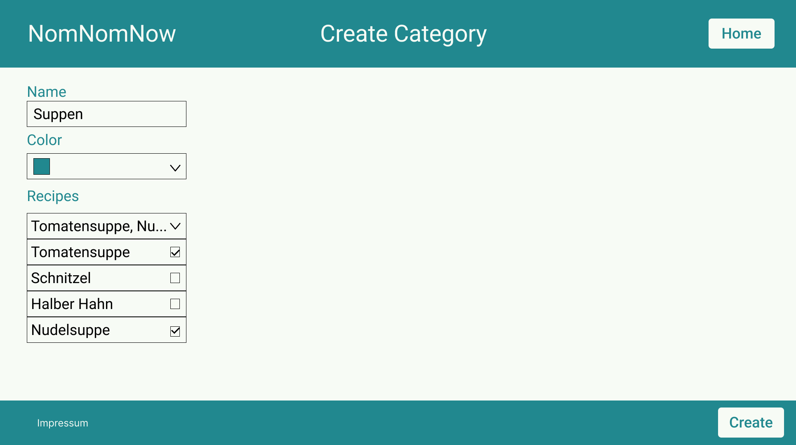
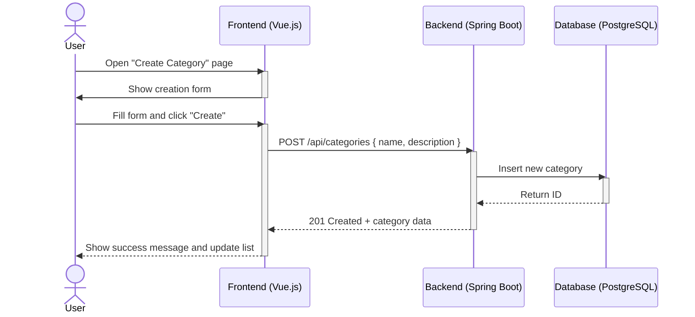

# Use-Case Specification: Creating a category

# 1. Getting an overview

## 1.1 Brief Description
This use case allows a user to create a category of food. 

## 1.2 Mockup

# 2. Flow of Events

## 2.1 Basic Flow
- User navigates to the Category overview
- The user clicks on the button create
- User inputs the Category data and presses create

### Activity Diagram

## 2.2 Alternative Flows
n/a

# 3. Special Requirements
n/a

# 4. Preconditions
The Preconditions for this use case are:
1. The user startet the App
2. The user has navigated to the category overview
3. The category does not already exist
# 5. Postconditions
The Postconditions for this use case are:
1. The user wants to see the overview
2. The user wants to be able to use and see the new category

### 5.1 Save changes / Sync with server
The category should be saved in the DB
# 6. Story Points
Storie Points: 4