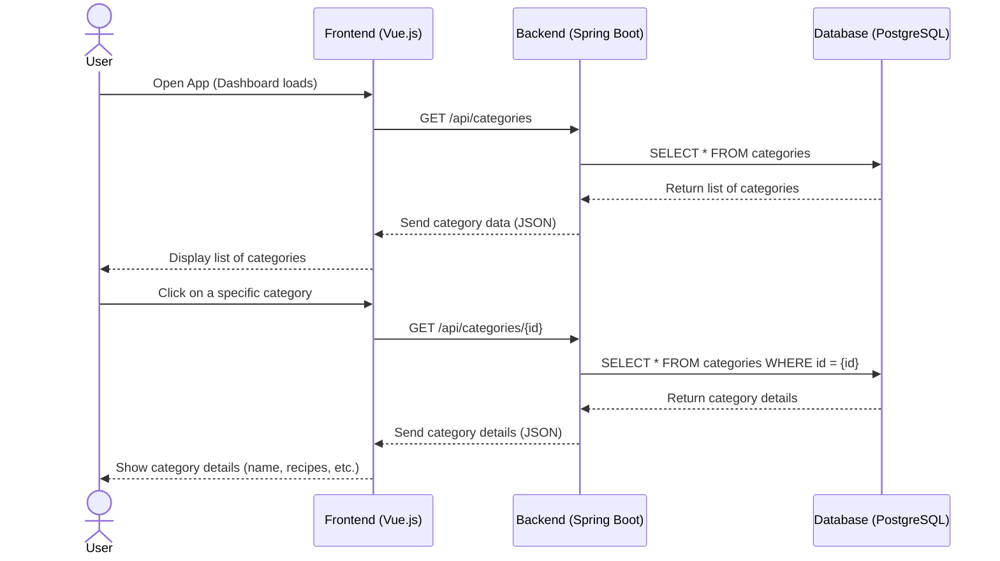

# Use-Case Specification: Category

# 1. Getting an overview

## 1.1 Brief Description
This use case allows a user to inspect a created category. 

## 1.2 Mockup

# 2. Flow of Events

## 2.1 Basic Flow
- User navigates to the dashboard
- User navigates to the Category overview
- User navigates to category
- User sees all recipes of category

### Activity Diagram

## 2.2 Alternative Flows
n/a

# 3. Special Requirements
n/a

# 4. Preconditions
The Preconditions for this use case are:
1. The user has started the App
2. The user has navigated to the dashboard
3. The user has navigated to the category

# 5. Postconditions
n/a

### 5.1 Save changes / Sync with server
n/a
# 6. Story Points
3