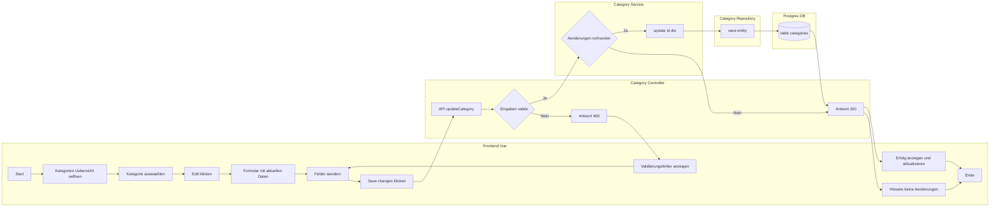

# Use-Case Specification: Editing a category

# 1. Getting an overview

## 1.1 Brief Description
This use case allows a user to edit a category. 

## 1.2 Mockup

# 2. Flow of Events

## 2.1 Basic Flow
- User navigates to the category overview
- User navigates to a single category overview
- User clicks on edit category
- User changes something at the category

### Sequence Diagram

### Activity Diagramm

## 2.2 Alternative Flows
n/a

# 3. Special Requirements
n/a

# 4. Preconditions
The Preconditions for this use case are:
1. The user has started the App
2. The user has navigated to the category overview of a single category
3. The user has clicked on the "edit category" button

# 5. Postconditions
The Postconditions for this use case are:
1. The changes are saved.

### 5.1 Save changes / Sync with server
The changes have to be saved in the DB.

# 6. Story Points
4