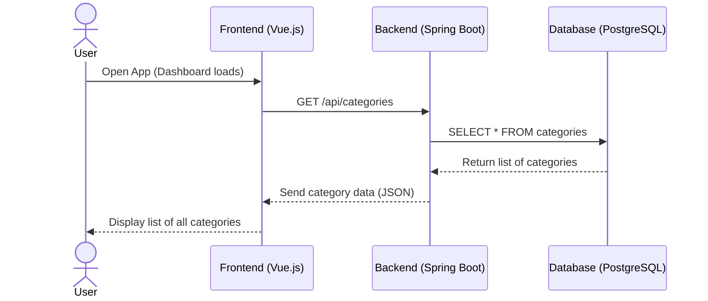

# Use-Case Specification: Overview of the categories

# 1. Getting an overview

## 1.1 Brief Description
This use case allows a user to get an overview of all categories. 

## 1.2 Mockup

# 2. Flow of Events

## 2.1 Basic Flow
- User navigates to the category overview

### Activity Diagram

## 2.2 Alternative Flows
n/a

# 3. Special Requirements
n/a

# 4. Preconditions
The Preconditions for this use case are:
1. The user has started the App
2. The user has navigated to the overview of categories

# 5. Postconditions
n/a

### 5.1 Save changes / Sync with server
n/a

# 6. Story Points
6