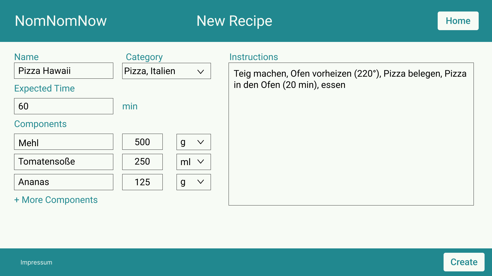
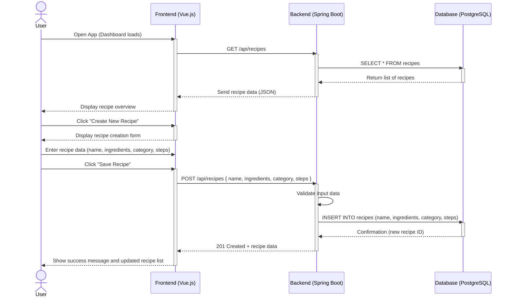
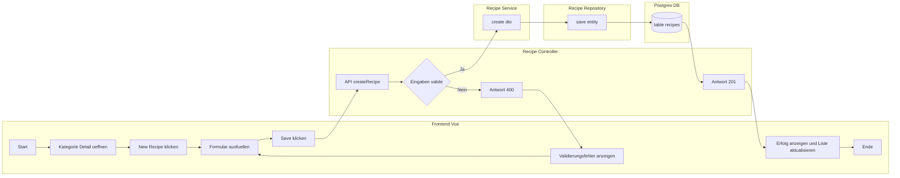

# Use-Case Specification: Creating a recipe

# 1. Getting an overview

## 1.1 Brief Description
This use case allows a user to create a recipe. 

## 1.2 Mockup

# 2. Flow of Events

## 2.1 Basic Flow
- User navigates to the overview of a single category
- User clicks on the "new" button
- User fills out the create recipe form
- User clicks on create

### Sequence Diagram

### Activity Diagram

## 2.2 Alternative Flows
n/a

# 3. Special Requirements
One Recipe can be connected to multiple categories.

# 4. Preconditions
The Preconditions for this use case are:
1. The user has started the App
2. The user has created a category

# 5. Postconditions
The Postconditions for this use case are:
1. The new recipe is saved

### 5.1 Save changes / Sync with server
The new recipe is saved in the DB.

# 6. Story Points
6