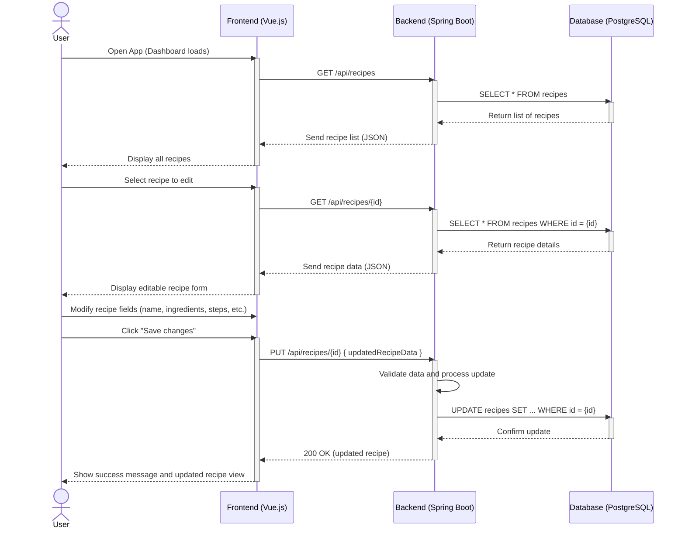

# Use-Case Specification: Editing a recipe

# 1. Getting an overview

## 1.1 Brief Description
This use case allows a user to edit a existing recipe. 

## 1.2 Mockup

# 2. Flow of Events

## 2.1 Basic Flow
- User navigates to the overview of a category
- User right clicks a recipe to edit it
- User changes something at the recipe

### Activity Diagram

## 2.2 Alternative Flows
n/a

# 3. Special Requirements
n/a

# 4. Preconditions
The Preconditions for this use case are:
1. The user has started the App
2. The user has created a recipe
3. The user has navigated to the overview of one category
4. The user has choosen to edit one of the recipes
5. The user has changed an attribute of the recipe

# 5. Postconditions
The Postconditions for this use case are:
1. The changes are saved.

### 5.1 Save changes / Sync with server
The changes are saved in the DB

# 6. Story Points
4