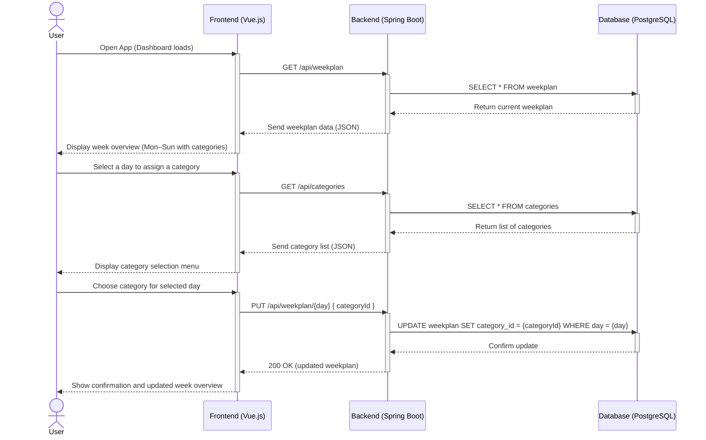
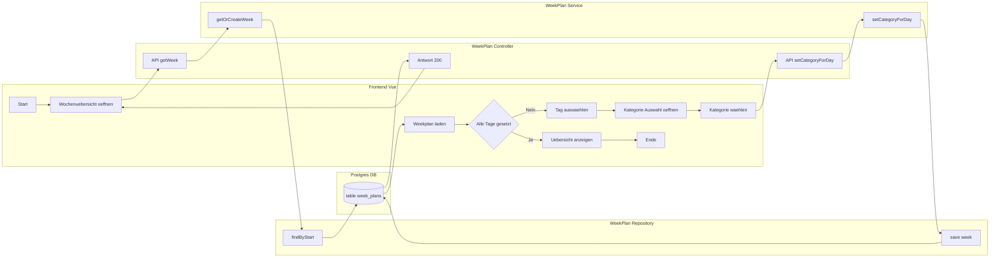

# Use-Case Specification: Choose a category per day

# 1. Getting an overview

## 1.1 Brief Description
This use case allows a user to see an overview of the week and choose a category for each day.

## 1.2 Mockup

# 2. Flow of Events

## 2.1 Basic Flow
- User navigates to the overview
- User selects the categories for the week

### Sequence Diagram

### Activity Diagram

## 2.2 Alternative Flows
n/a

# 3. Special Requirements
n/a

# 4. Preconditions
The Preconditions for this use case are:
1. The user has started the App
2. The user has navigated to the overview of a week
3. At least one category with one recipe was created

# 5. Postconditions
The Postconditions for this use case are:
1. The user has selected his categories

### 5.1 Save changes / Sync with server
n/a

# 6. Story Points
4