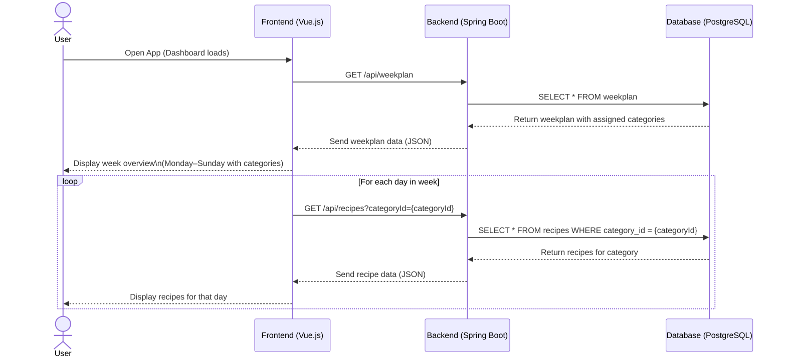

# Use-Case Specification: Overview of the week

# 1. Getting an overview

## 1.1 Brief Description
This use case allows a user to see an overview of the week and the recipes for each day. 

## 1.2 Mockup

# 2. Flow of Events

## 2.1 Basic Flow
- User navigates to the week overview
- User selects the categories for every day of the week
- User generates the recipes for the week

### Activity Diagram

## 2.2 Alternative Flows
- User navigates to the week overview
- User selects the categories for every day of the week
- User generates the recipes for the week
- User regenerates the recipes for the week

# 3. Special Requirements
n/a

# 4. Preconditions
The Preconditions for this use case are:
1. The user has started the App
2. The user has navigated to the overview of a week
3. At least one category with one recipe was created

# 5. Postconditions
The Postconditions for this use case are:
1. The user wants to see the recipes of the weeks
2. The user wants to be able to generate recipes for the week
3. The user wants to be able to get a shopping list

### 5.1 Save changes / Sync with server
The generated recipes for a week should be saved in the DB.

# 6. Story Points
10