# Projekthandout - Nom Nom Now

Stand: 01.06.2026  
Quelle: lokale Repositories `nom-nom-now-frontend` und `nom-nom-now-backend`

> Hinweis: Alles mit `TODO` muss noch mit euren echten Projektmanagementdaten, Namen, Stunden, Screenshots oder Links ergänzt werden. Technische Angaben wurden aus den beiden Repositories abgeleitet.

## 1. Projektname

**Nom Nom Now**

Nom Nom Now ist eine Rezept- und Essensplanungs-App. Nutzerinnen und Nutzer können Rezepte entdecken, erstellen, bearbeiten und löschen, einen Wochenplan pflegen und daraus Einkaufslisten generieren.

Repositorys:

- Frontend: `git@github.com:Nom-Nom-Now/nom-nom-now-frontend.git`
- Backend: `git@github.com:Nom-Nom-Now/nom-nom-now-backend.git`
- Scrum Board: `https://nomnomnow.atlassian.net/jira/software/projects/NNN/boards/1`
- Weitere Dokumentation/Blog/Zusammenfassung: `https://github.com/Nom-Nom-Now/docs`

## 2. Projektvision und Ziel

Ziel des Projekts ist eine alltagstaugliche Web-App für Essensplanung. Der Kernnutzen liegt darin, Rezepte, Wochenplanung und Einkaufsvorbereitung in einem zusammenhängenden System abzubilden:

- Rezepte können mit Zutaten, Zubereitung, Kategorien und optionalem Bild gepflegt werden.
- Rezepte können über eine Liste durchsucht und in Detailansichten geöffnet werden.
- Ein Wochenplan ordnet Rezepte einzelnen Tagen zu.
- Aus einem Wochenplan können Einkaufslisten erzeugt und später wieder geöffnet oder gelöscht werden.
- Authentifizierung läuft produktiv über Google OAuth2; lokal gibt es ein Dev-Profil mit Testnutzer.

## 3. Aufwandsstatistiken

### 3.1 Arbeitsstunden pro Person

Die echten Arbeitsstunden stehen nicht in den Repositories und müssen aus eurem Projektmanagement/Scrum Board ergänzt werden.

| Person         | Arbeitsstunden | Hauptbeitrag                                                       | Quelle/Kommentar                                                                           |
|----------------|---------------:|--------------------------------------------------------------------|--------------------------------------------------------------------------------------------|
| Rafael Till    |             65 | CI/CD und Backendentwickler                                        | Git-Autor in Frontend und Backend sichtbar: 'rafiistcool'                                  |
| Silas Scholler |             54 | Wochenaufgaben Frontendentwickler                                  | Git-Autor in Frontend und Backend sichtbar: `SilasSch`                                     |
| Tino Wolter    |             63 | Frontendentwickler, Frontendarchitektur, Mock-ups und Reviews      | Git-Autor im Frontend sichtbar: `tinow04`                                                  |
| Robin Fischer  |             58 | Frontendentwickler, Mock-ups, Backendentwickler und Wochenaufgaben | Git-Autor im Frontend und Backend sichtbar: `Robin0106` und Paircode mit Rafael im Backend |
| Dylan O'Reilly |             43 | Frontendentwickler und Projektmanagement                           | Git-Autor in Frontend und Backend sichtbar: 'dlllln', mündliche Prüfung im 3. Semester     |

### 3.2 Arbeitsstunden pro Workflow

| Workflow                     | Arbeitsstunden | Kommentar                                              |
|------------------------------|---------------:|--------------------------------------------------------|
| Requirement Analysis         |             10 | Anforderungen, User Stories, Akzeptanzkriterien        |
| Project Management           |             50 | Sprintplanung, Boardpflege, Reviews, Koordination      |
| Architecture & Design        |             20 | Frontend-/Backend-Struktur, Datenmodell, API-Vertraege |
| Frontend Development         |             50 | Vue-App, Feature-Module, UI, i18n                      |
| Backend Development          |             50 | Spring Boot API, Services, Security, Datenbankzugriff  |
| Database Design & Migration  |             15 | PostgreSQL-Schema, Flyway-Migrationen                  |
| Testing & Quality Assurance  |             20 | Unit-/Service-/Controller-Tests, Linting, Type Checks  |
| CI/CD & Deployment           |             15 | GitHub Actions, Docker Images, Server Deployment       |
| Documentation & Presentation |             25 | README, Handout, Folien, Abschlussdokumentation        |

Die Stunden sind bei den Stunden pro Person teilweise doppelt eingerechnet, sollten mehrere Personen an einem Workflow gearbeitet haben.

### 3.3 Arbeitsstunden pro Phase

Bitte mit euren echten Projektdaten ergaenzen.

| Phase        | Arbeitsstunden |
|--------------|----------------|
| Inception    | 45             | Projektidee, Vision, erste Anforderungen, Risiken |
| Elaboration  | 31             | Architekturentscheidungen, SRS/SAD, Datenmodell, Prototypen |
| Construction | 130            | Implementierung der Kernfeatures, Tests, CI/CD |
| Transition   | 47             | Stabilisierung, Demo, Dokumentation, Deployment |

## 4. Demo-Highlights

### 4.1 Login und Startseite

Beschreibung:

- Produktiv: Google OAuth2 Login.
- Lokal: Dev-Profil mit automatisch angemeldetem Testnutzer.
- Die App nutzt eine Shell mit Navigation und Seitentitel. Login wird als Vollbildseite ohne Shell angezeigt.

Screenshot:

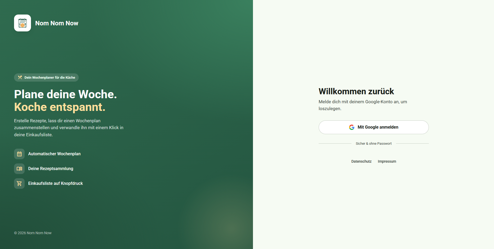

### 4.2 Rezepte erstellen

Beschreibung:

- Mehrstufiger Rezept-Wizard.
- Schritte: Zutaten, Zubereitung, Kategorien, Bild, Vorschau.
- Backend validiert Requests und speichert Rezept, Zutaten, Komponenten, Kategorien und optional Bilddaten.

Screenshot:

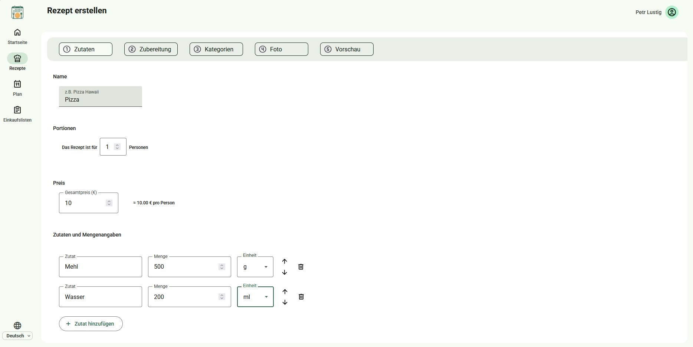
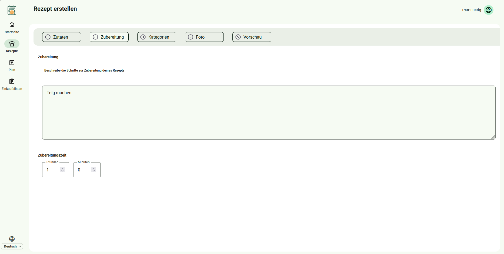
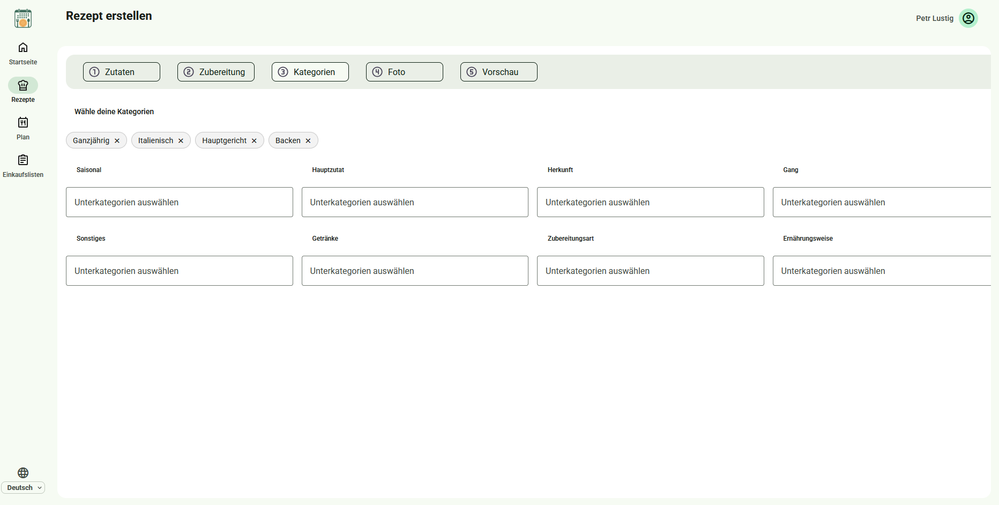
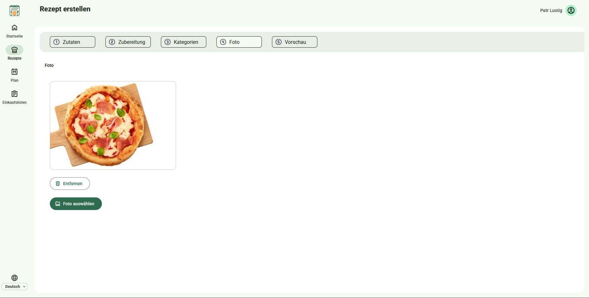
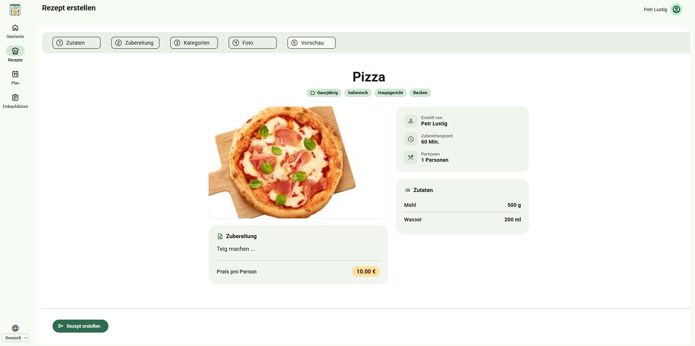

### 4.3 Rezepte suchen, ansehen, bearbeiten und loeschen

Beschreibung:

- Rezeptliste mit Such-/Browse-Flow.
- Detailansicht für einzelne Rezepte.
- Bearbeitungsflow mit eigenem Store und Service.
- Löschen ist als geschützter Owner-Flow im Backend umgesetzt.

Suchfunktion:

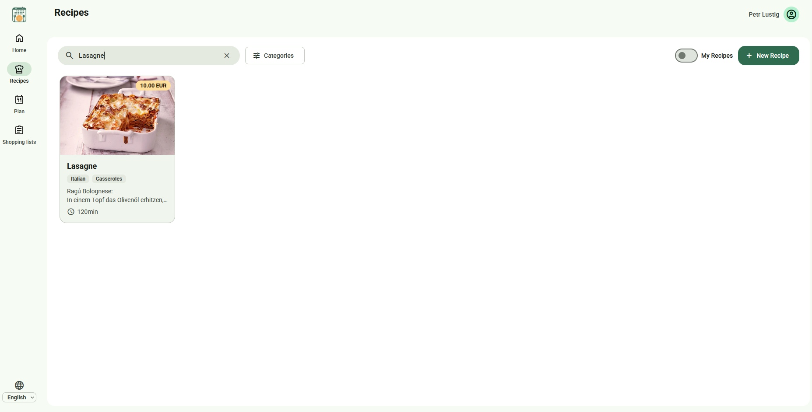

Detailansicht:

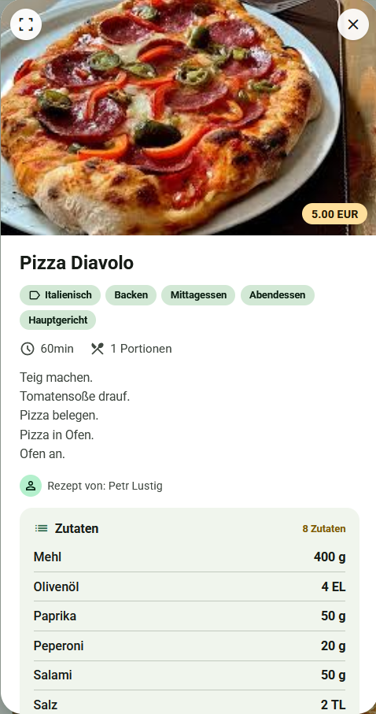

Bearbeiten:

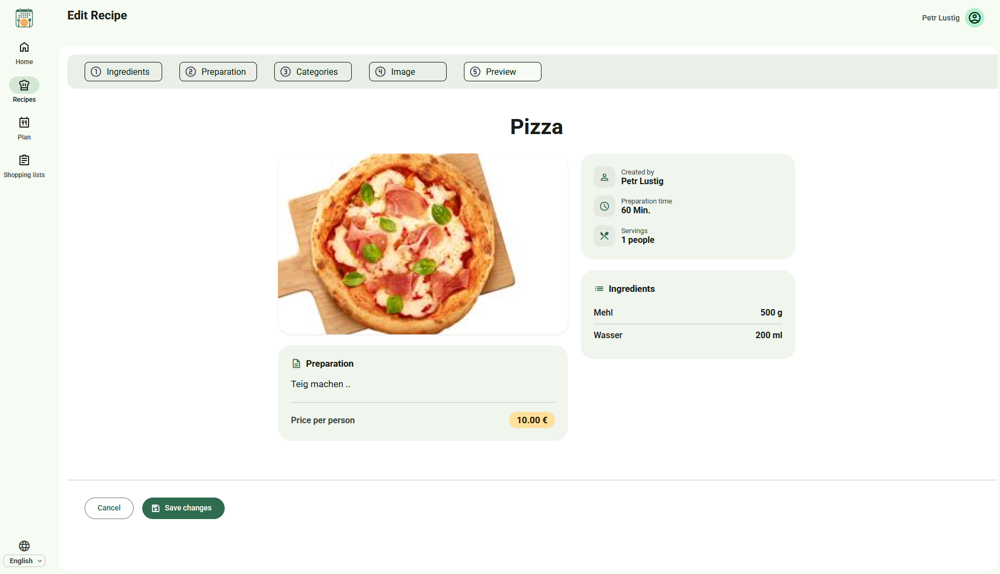

Löschen:

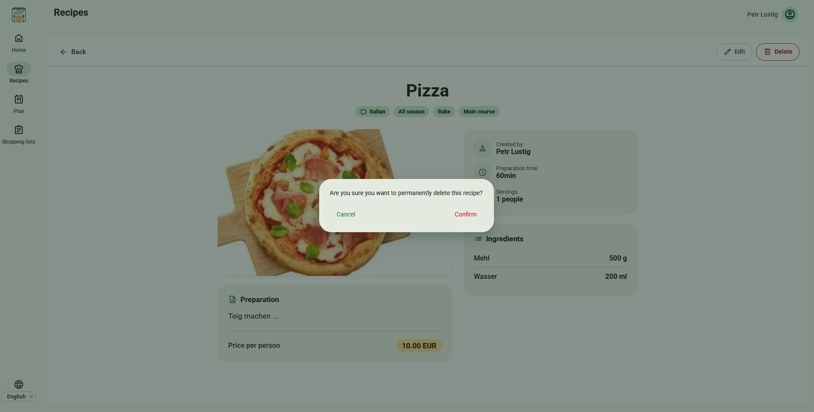

### 4.4 Wochenplan

Beschreibung:

- Wochenplan unter `/plan`.
- Backend-Endpunkte für Wochenplan laden, speichern und einzelne Tage neu belegen.
- Pro Nutzer und Datum ist ein Planeintrag eindeutig.

Screenshot:

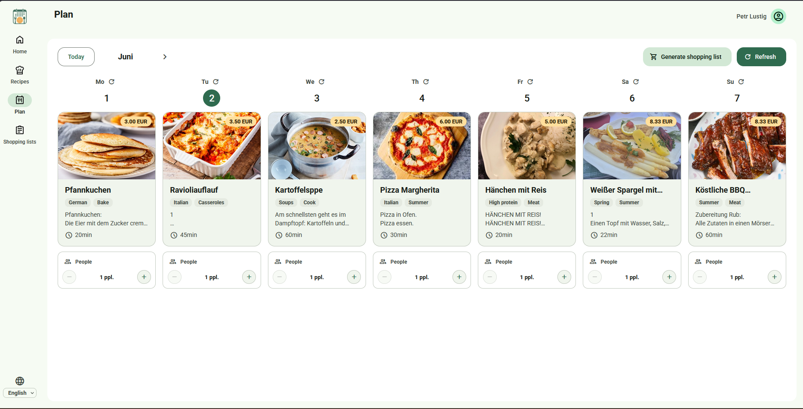

### 4.5 Einkaufslisten

Beschreibung:

- Einkaufslisten werden aus Wochenplaenen generiert.
- Gespeicherte Einkaufslisten können wieder geoeffnet werden.
- Einkaufslisten sind nutzerbezogen.
- Löschen ist owner-scoped und im Frontend mit Bestätigungsdialog abgesichert.

Screenshot:

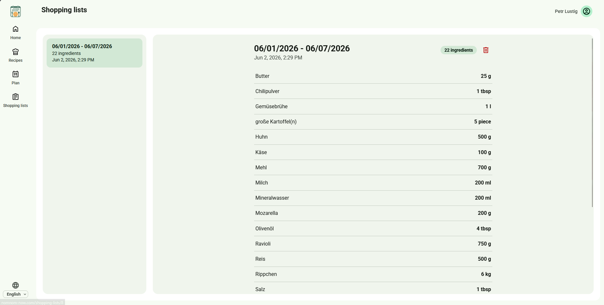

## 5. Projekt-Highlights

### 5.1 Architektur

Nom Nom Now ist als getrennte Frontend-/Backend-Webanwendung aufgebaut.

```text
Browser
  -> Vue 3 SPA
      -> Feature-Komponenten
      -> Pinia Stores
      -> Services / DTO-Mapping
      -> HTTP Requests
  -> Spring Boot REST API
      -> Controller
      -> Services
      -> Repositories
      -> PostgreSQL
```

Frontend:

- Vue 3 Single Page Application mit Composition API.
- Feature-basierte Struktur unter `src/feature/`.
- App-Shell-Pattern mit Navigation, Header und `<router-view />`.
- Vue Router mit Routen für Login, Home, Plan, Rezepte, Rezeptbearbeitung und Einkaufslisten.
- Pinia für reaktiven Feature-State.
- Services kapseln API-Kommunikation und Mapping zwischen UI-Modell und Backend-DTOs.
- i18n über `vue-i18n` mit deutschen und englischen Locale-Dateien.
- Material Web Components für UI-Bausteine.

Backend:

- Spring Boot 4 REST API mit Java 25.
- Schichten: Controller, DTOs, Mapper, Services, Repositories, Entities.
- Spring Data JPA für Datenzugriff.
- PostgreSQL als relationale Datenbank.
- Flyway für versionierte Datenbankmigrationen.
- Spring Security mit Google OAuth2 im Produktivbetrieb.
- Dev-Profil mit lokalem Testnutzer für schnellere Entwicklung ohne Google Login.

### 5.2 Architekturentscheidungen und Begründung

| Entscheidung                       | Begründung                                                                                |
|------------------------------------|-------------------------------------------------------------------------------------------|
| Getrennte Frontend-/Backend-Repos  | Klare Verantwortlichkeiten, unabhaengige CI/CD-Pipelines und getrennte Deployments        |
| Vue 3 + Vite + TypeScript          | Schnelle Entwicklung, Typsicherheit, moderne SPA-Struktur                                 |
| Feature-basierte Frontend-Struktur | Features kapseln Komponenten, Stores, Services und Typen erleichtert parallele Teamarbeit |
| Spring Boot + Spring Data JPA      | Schnelle REST-API-Entwicklung, gute Integration von Persistence, Validation und Security  |
| PostgreSQL + Flyway                | Robustes relationales Modell und nachvollziehbare Schema-Evolution                        |
| OAuth2 mit Google                  | Standardisierte Authentifizierung statt eigener Passwortverwaltung                        |
| Dev-Profil ohne OAuth2             | Lokale Entwicklung und Tests ohne externe Login-Abhängigkeit                              |
| Docker + GHCR                      | Reproduzierbare Builds und deploybare Container-Artefakte                                 |

### 5.3 Angewandte Design Patterns

| Pattern/Prinzip        | Umsetzung im Projekt                                                                                   |
|------------------------|--------------------------------------------------------------------------------------------------------|
| Layered Architecture   | Backend trennt Controller, Service, Repository und Entity                                              |
| Repository Pattern     | Spring Data Repositories kapseln Datenbankzugriffe                                                     |
| DTO Pattern            | Request-/Response-Klassen trennen API-Vertrag von JPA-Entities                                         |
| Mapper Pattern         | `RecipeMapper` bildet zwischen Entity und Response DTO ab                                              |
| Service Layer          | Business-Logik liegt in `RecipeService`, `RecipePlanService`, `ShoppingListService`, `CategoryService` |
| Feature Module Pattern | Frontend-Features besitzen eigene Komponenten, Stores, Services und Typen                              |
| Store Pattern          | Pinia Stores verwalten UI- und Feature-State                                                           |
| App Shell Pattern      | Gemeinsame Navigation/Header-Struktur mit route-basiertem Vollbildmodus fuer Login                     |

## 6. Tech-Stack

### 6.1 Frontend

| Bereich               | Technik                               |
|-----------------------|---------------------------------------|
| Framework             | Vue 3.5                               |
| Sprache               | TypeScript 5.8                        |
| Build Tool            | Vite 7                                |
| Routing               | Vue Router 4                          |
| State Management      | Pinia 3                               |
| Internationalisierung | vue-i18n 11                           |
| UI                    | Material Web Components               |
| Tests                 | Vitest, Vue Test Utils, jsdom         |
| Linting/Formatierung  | ESLint 9, Prettier 3                  |
| Deployment            | Docker Multi-Stage Build, Nginx, GHCR |

### 6.2 Backend

| Bereich           | Technik                                          |
|-------------------|--------------------------------------------------|
| Framework         | Spring Boot 4.0.5                                |
| Sprache           | Java 25                                          |
| Build Tool        | Maven Wrapper                                    |
| API               | Spring Web MVC                                   |
| Persistence       | Spring Data JPA                                  |
| Datenbank         | PostgreSQL                                       |
| Migrationen       | Flyway                                           |
| Security          | Spring Security, OAuth2 Client, Google Login     |
| API-Dokumentation | springdoc-openapi / Swagger UI                   |
| Tests             | Spring Boot Test, JUnit, Mockito, Testcontainers |
| Deployment        | Docker Multi-Stage Build, GHCR, Docker Compose   |

### 6.3 Infrastruktur

- GitHub Actions fuer CI/CD.
- GitHub Container Registry (`ghcr.io`) für Frontend- und Backend-Images.
- Docker Compose für PostgreSQL, Flyway, Backend und Frontend.
- Produktivdeployment per SSH/SCP auf Server.

## 7. API und zentrale Features

### 7.1 Backend-Endpunkte

| Bereich        | Endpunkte                                                                                                                             |
|----------------|---------------------------------------------------------------------------------------------------------------------------------------|
| Auth           | `GET /auth/me`                                                                                                                        |
| Kategorien     | `GET /categories`                                                                                                                     |
| Rezepte        | `GET /recipes`, `GET /recipes/{id}/image`, `GET /recipes/user/{userId}`, `POST /recipes`, `PUT /recipes/{id}`, `DELETE /recipes/{id}` |
| Wochenplan     | `GET /api/recipe-plans`, `POST /api/recipe-plans`, `PATCH /api/recipe-plans/{planDate}/refresh`                                       |
| Einkaufslisten | `POST /api/shopping-lists`, `GET /api/shopping-lists`, `GET /api/shopping-lists/{id}`, `DELETE /api/shopping-lists/{id}`              |

### 7.2 Frontend-Routen

| Route                  | Zweck                                      |
|------------------------|--------------------------------------------|
| `/`                    | Login                                      |
| `/home`                | Startseite                                 |
| `/plan`                | Wochenplan                                 |
| `/recipes`             | Rezeptbereich                              |
| `/recipes/create`      | Rezept erstellen                           |
| `/recipes/edit/:id`    | Rezept bearbeiten                          |
| `/shopping-lists/:id?` | Einkaufslistenuebersicht und Detailansicht |

## 8. Datenbankdesign

Die Datenbank liegt in PostgreSQL im Schema `app`. Schemaaenderungen werden mit Flyway versioniert. Aktuell liegen 10 Migrationen vor.

### 8.1 Zentrale Tabellen

| Tabelle                  | Zweck                                                                          |
|--------------------------|--------------------------------------------------------------------------------|
| `app.app_user`           | Nutzer mit Google-ID, E-Mail, Name und Erstellzeitpunkt                        |
| `app.recipe`             | Rezeptstammdaten, u.a. Name, Zubereitung, Kochzeit, Preis-/Bilddaten und Owner |
| `app.ingredient`         | Zutatenstammdaten                                                              |
| `app.recipe_component`   | Zuordnung Rezept - Zutat mit Menge und Einheit                                 |
| `app.category`           | Kategorien                                                                     |
| `app.recipe_category`    | Many-to-many-Zuordnung Rezept - Kategorie                                      |
| `app.recipe_plan`        | Nutzerbezogene Wochenplaneintraege                                             |
| `app.shopping_list`      | Nutzerbezogene Einkaufslisten                                                  |
| `app.shopping_list_item` | Positionen einer Einkaufsliste                                                 |

### 8.2 Beziehungen und Constraints

- Rezepte gehoeren optional/eindeutig zu einem Owner (`recipe.owner_id -> app_user.id`).
- Rezeptkomponenten referenzieren Rezept und Zutat; beim Loeschen eines Rezepts werden Komponenten per Cascade entfernt.
- Rezept-Kategorien sind als Many-to-many-Tabelle modelliert.
- Wochenplaene referenzieren Owner und Rezept.
- Pro Owner und Datum gibt es im Wochenplan nur einen Eintrag (`UNIQUE (owner_id, plan_date)`).
- Einkaufslisten und Einkaufslistenpositionen sind per Fremdschluessel verbunden; Items werden beim Loeschen der Liste per Cascade entfernt.
- Datenbankindizes existieren u.a. für Rezeptkomponenten, Kategorien, Rezept-Owner, Wochenplan nach Owner/Datum und Einkaufslisten nach Owner/Erstellzeitpunkt.
  ########################################################## TODO ERM ##########################################################
## 9. Testing und Qualitaetssicherung

### 9.1 Backend-Tests

Testdateien:

- `NomNomNowBackendApplicationTests`
- `RecipeControllerTest`
- `ShoppingListControllerTest`
- `DemoDataSeederTest`
- `RecipePlanServiceTest`
- `RecipeServiceTest`
- `ShoppingListServiceTest`
- `AuthControllerTest`
- `CurrentUserServiceTest`

Abgedeckte Bereiche:

- Application Context
- Controller-Verhalten fuer Rezepte, Einkaufslisten und Auth
- Service-Logik fuer Rezepte, Wochenplaene und Einkaufslisten
- Demo-Daten-Seeding
- Current-User-Aufloesung

CI-Befehl:

```bash
./mvnw -B verify
```

### 9.2 Frontend-Tests

Testdateien:

- `HomePage.test.ts`
- `PlanFrame.test.ts`
- `WeeklyRecipePlanService.test.ts`
- `authService.test.ts`
- `categoryMapper.test.ts`
- `createRecipeService.test.ts`
- `useCreateRecipeStore.test.ts`
- `useRecipeListStore.test.ts`
- `ShoppingListService.test.ts`
- `ShoppingListsPage.test.ts`
- `useShoppingListStore.test.ts`
- `apiFetch.test.ts`

Abgedeckte Bereiche:

- Komponentenverhalten
- Pinia Stores
- API-Services
- DTO-/Kategorie-Mapping
- Auth- und Redirect-Hilfen

CI-Befehle:

```bash
npm run type-check
npm run lint
npm run test:unit
npm run build
```

### 9.3 Teststrategie

- Backend: Unit-/Service-Tests und Controller-Tests mit Spring-Testumgebung.
- Frontend: Vitest-Tests fuer Stores, Services und wichtige Komponenten.
- TypeScript Type Checks verhindern viele Integrationsfehler im Frontend.
- ESLint und Prettier sichern Code-Stil und Konsistenz.
- CI laeuft bei Pull Requests bzw. Pushes und blockiert fehlerhafte Builds.

### 9.4 Coverage

`TODO: Echte Coverage-Werte einfuegen, falls ihr sie gemessen habt.`

Vorschlag fuer finale Tabelle:

| Bereich | Coverage | Tool | Kommentar |
|---|---:|---|---|
| Backend | TODO | TODO: JaCoCo oder anderes Tool | TODO |
| Frontend | TODO | TODO: Vitest Coverage oder anderes Tool | TODO |

## 10. Softwarequalität

Angestrebtes 3A in den Metriken über SonarQube:

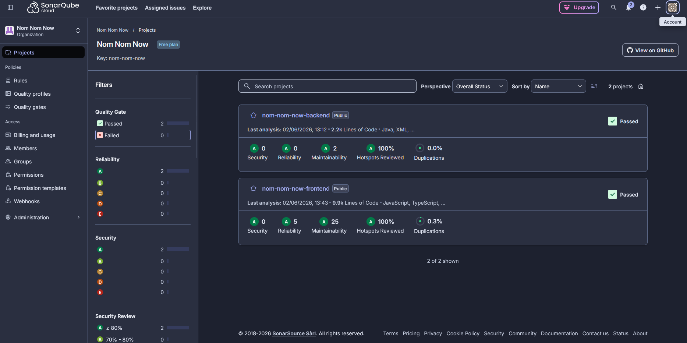

## 11. CI/CD Setup

### 11.1 Backend CI

Datei: `.github/workflows/backendCi.yml`

- Trigger: Pull Requests auf `main`.
- Setup: Ubuntu Runner, Checkout, Java 25 mit Temurin, Maven Cache.
- Schritt: `./mvnw -B verify`.

### 11.2 Backend CD

Datei: `.github/workflows/backendCd.yml`

- Trigger: Push auf `main`.
- Docker Buildx baut das Backend-Image.
- Push nach GitHub Container Registry mit Tags `latest` und Kurz-SHA.
- Deployment-Job:
  - kopiert `compose.yaml` und Flyway-Migrationen per SSH/SCP auf den Server,
  - erzeugt `.env` aus GitHub Secrets,
  - startet PostgreSQL,
  - fuehrt Flyway-Migrationen aus,
  - deployed das Backend per Docker Compose.

### 11.3 Frontend CI

Datei: `.github/workflows/ci.yml`

- Trigger: Push und Pull Requests auf `main` und `develop`.
- Setup: Node.js 20 mit npm Cache.
- Schritte:
  - `npm ci`
  - `npm run type-check`
  - `npm run lint`
  - `npm run test:unit`
  - `npm run build`

### 11.4 Frontend CD

Datei: `.github/workflows/frontendCd.yml`

- Trigger: Push auf `main`.
- Docker Buildx baut das Frontend-Image.
- Build-Argument: `VITE_API_BASE_URL=/api`.
- Push nach GitHub Container Registry mit Tags `latest` und Kurz-SHA.
- Deployment per SSH und Docker Compose.

## 12. Gelerntes im Projekt

- Abstimmung von Frontend-DTOs und Backend-API ist entscheidend, um Integrationsfehler zu vermeiden.
- Datenbankmigrationen muessen frueh sauber gepflegt werden, da nachtraegliche Schemaaenderungen sonst teuer werden.
- CI/CD lohnt sich besonders bei getrennten Frontend-/Backend-Repositories.
- Authentifizierung sollte fuer lokale Entwicklung bewusst vereinfacht werden, ohne die produktive Sicherheit zu entfernen.
- Feature-basierte Struktur hilft bei wachsenden Vue-Anwendungen.
- Gute Tests für Services und Stores fangen viele Fehler ab, bevor sie in der UI sichtbar werden.

## 14. Offene To-dos fuer das finale Handout

- [ ] Echte Coverage-Werte messen und eintragen.
- ERM einfügen
- [ ] Rechtschreibung/Formatierung fuer finale PDF-/Print-Version pruefen.
